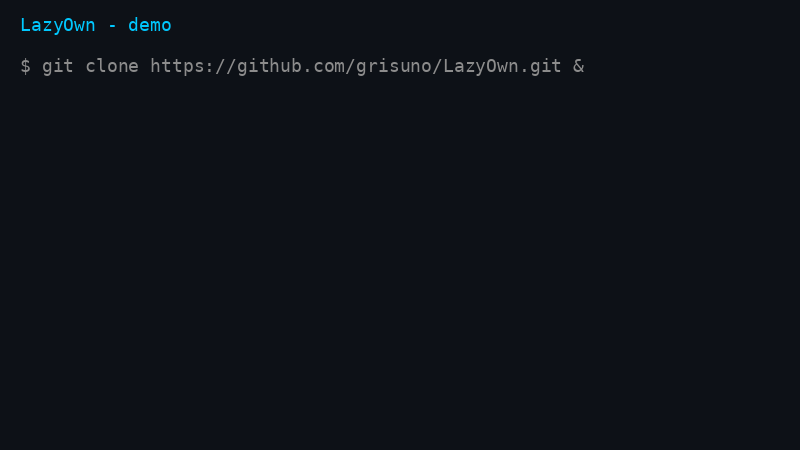
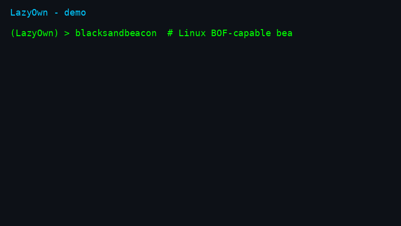
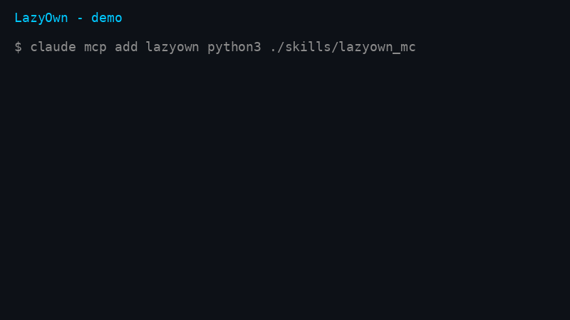
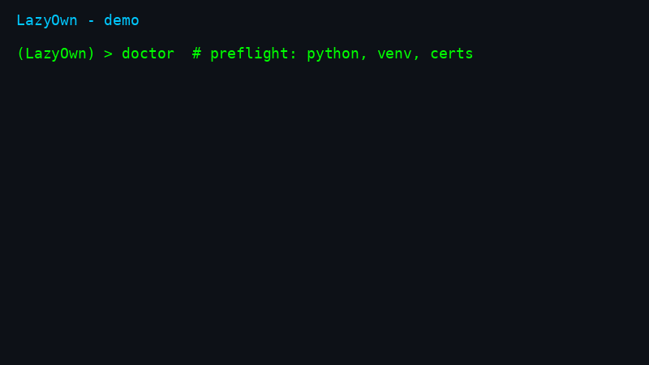
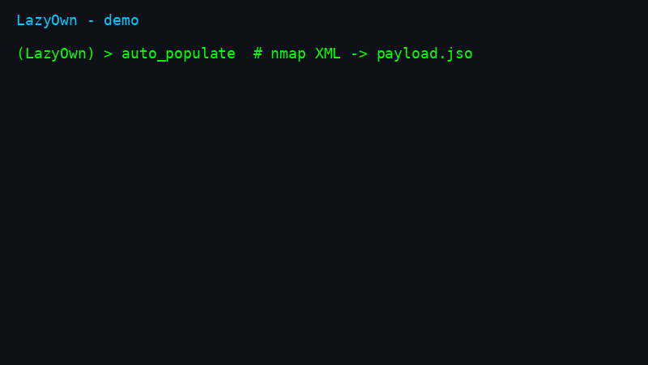
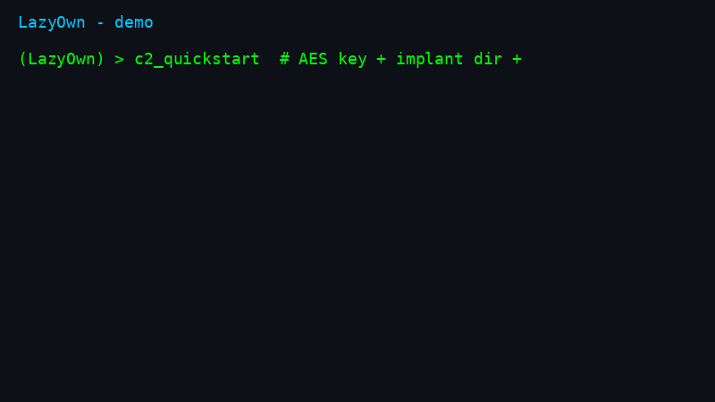
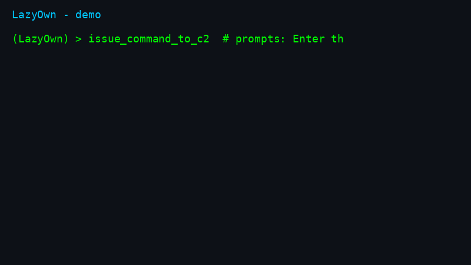

# LazyOwn — RedTeam Framework with AI agents, Linux BOF beacon, YARA+Nuclei marketplace


[](https://github.com/grisuno/LazyOwn/stargazers)
[](https://github.com/grisuno/LazyOwn/releases)
[](https://github.com/grisuno/LazyOwn/pkgs/container/lazyown)
[](https://github.com/grisuno/LazyOwn/actions/workflows/ci.yml)
[](https://www.gnu.org/licenses/gpl-3.0)
[](https://deepwiki.com/grisuno/LazyOwn)

> **748 CLI commands. Multi-operator C2. 153 MCP tools for AI agents. The only OSS C2 with Linux BOF support + built-in YARA/Nuclei marketplaces.**

## Install in one command

```bash
curl -fsSL https://raw.githubusercontent.com/grisuno/LazyOwn/main/bootstrap.sh -o /tmp/bootstrap.sh \
  && bash /tmp/bootstrap.sh
```

| Try in 60 seconds (no install) | Golden path (every engagement) | One-command auto-pwn |
|---|---|---|
| `docker run -it ghcr.io/grisuno/lazyown:latest` | `ping > lazynmap > auto_populate > facts_show > recommend_next` | `engage 10.10.11.5` |





### More demos

| First 7 commands | Recon loop |
|---|---|
|  |  |

| C2 from CLI | Issue commands to beacons |
|---|---|
|  |  |

Full walkthrough: [`QUICKSTART.md`](QUICKSTART.md) (5 min) · 80/20 guide: [`ESSENTIALS.md`](ESSENTIALS.md) · HTB end-to-end: [`docs/examples/htb-lame-walkthrough.md`](docs/examples/htb-lame-walkthrough.md) · Honest comparison: [`COMPARISON.md`](COMPARISON.md)

### Why LazyOwn vs Sliver / Havoc / Mythic / Caldera / Metasploit

| Capability | LazyOwn | Sliver | Havoc | Mythic | Caldera | Metasploit |
|---|:-:|:-:|:-:|:-:|:-:|:-:|
| Linux BOF support | yes | no | no | no | no | no |
| YARA + Nuclei marketplace built-in | yes | no | no | no | no | no |
| MCP server for AI agents (153 tools) | yes | no | no | no | no | no |
| LLM operator + multi-agent hive | yes | no | no | no | no | no |
| Multi-operator C2 + phishing engine | yes | partial | partial | partial | partial | partial |

Full table: [`COMPARISON.md`](COMPARISON.md). Found an error? Open an issue, we fix it.


```sh
 ██▓    ▄▄▄      ▒███████▒▓██   ██▓ ▒█████   █     █░███▄    █
▓██▒   ▒████▄    ▒ ▒ ▒ ▄▀░ ▒██  ██▒▒██▒  ██▒▓█░ █ ░█░██ ▀█   █
▒██░   ▒██  ▀█▄  ░ ▒ ▄▀▒░   ▒██ ██░▒██░  ██▒▒█░ █ ░█▓██  ▀█ ██▒
▒██░   ░██▄▄▄▄██   ▄▀▒   ░  ░ ▐██▓░▒██   ██░░█░ █ ░█▓██▒  ▐▌██▒
░██████▒▓█   ▓██▒▒███████▒  ░ ██▒▓░░ ████▓▒░░░██▒██▓▒██░   ▓██░
░ ▒░▓  ░▒▒   ▓▒█░░▒▒ ▓░▒░▒   ██▒▒▒ ░ ▒░▒░▒░ ░ ▓░▒ ▒ ░ ▒░   ▒ ▒
░ ░ ▒  ░ ▒   ▒▒ ░░░▒ ▒ ░ ▒ ▓██ ░▒░   ░ ▒ ▒░   ▒ ░ ░ ░ ░░   ░ ▒░
  ░ ░    ░   ▒   ░ ░ ░ ░ ░ ▒ ▒ ░░  ░ ░ ░ ▒    ░   ░    ░   ░ ░
    ░  ░     ░  ░  ░ ░     ░ ░         ░ ░      ░            ░
                 ░         ░ ░
```

[](https://ko-fi.com/Y8Y2Z73AV)


LazyOwn comes with ABSOLUTELY NO WARRANTY. This is free software, and you are  welcome to redistribute it under the terms of the GNU General Public License v3.
See the LICENSE file for details about using this software.

 # LazyOwn RedTeam Framework v0.2.161

LazyOwn is a professional red team framework and Command & Control (C2) platform built for penetration testers, red teams, and security researchers. It delivers 748 CLI commands, 126 aliases, 153 MCP tools for AI agents, a multi-operator web C2 dashboard, and 137 YAML/Lua plugin integrations covering the full kill chain across Linux, Windows, macOS, and BSD.

**New in v0.2.161:** integrated marketplace with YARA rules + Nuclei templates, `auto_pwn` autonomous exploitation, `hunt` command for threat-informed recon, post-command tips engine, automatic session data encryption, gamified ELO/badges, and 7 new APT playbooks.

## Quickstart in three commands

New here? This is the whole on-ramp. Full walkthrough: [`QUICKSTART.md`](QUICKSTART.md).

Fastest path (one-liner: clones into `~/LazyOwn`, installs, then asks whether
to start a normal `./run` session or the full `fast_run_as_r00t.sh` stack):

```bash
curl -fsSL https://raw.githubusercontent.com/grisuno/LazyOwn/main/bootstrap.sh -o /tmp/bootstrap.sh \
  && bash /tmp/bootstrap.sh
```

(One-command alternative: `curl -fsSL https://raw.githubusercontent.com/grisuno/LazyOwn/main/bootstrap.sh | bash`.)

If `~/LazyOwn` already exists, the installer asks whether to update in place, do a clean reinstall (backing up `payload.json` to `/tmp` first), use another directory, or abort.

Or step by step:

```bash
git clone https://github.com/grisuno/LazyOwn.git && cd LazyOwn
bash install.sh        # virtualenv + pinned dependencies + C2 certificates
./run                  # launches the shell; first run offers the setup wizard
```

The default install is light; add `--with-ml` for the heavy torch/CUDA stack, `--with-ollama` for the local LLM runtime, `--with-tools` for the common external binaries (forward them through the one-liner with `bash -s -- <flags>`). Dependencies are pinned in `requirements.txt` (cross-platform core) and `requirements-ml.txt` (optional ML); `pyproject.toml` is the single source of truth.

### Docker

For isolated, reproducible engagements, see [`lazyown-docker/README.md`](lazyown-docker/README.md).

```bash
cd lazyown-docker
./mkdocker.sh build
./mkdocker.sh run --vpn 1
```

Then, inside the `(LazyOwn) >` shell:

```text
doctor          # preflight: verifies Python, venv, packages, certs, SecLists, tools
wizard          # guided config (auto-detects lhost, walks 8 steps incl. LLM provider)
ping            # confirm the target is up and detect its OS
lazynmap        # full port + service scan
```

If `doctor` reports a blocking failure (red), fix it before going further — it
tells you the exact `pip install` / `apt install` command for whatever is
missing. Warnings (yellow) are optional features you can ignore for now.

# Core Architecture
LazyOwn is built around a modular, command-driven architecture that provides flexibility and extensibility for security testing workflows.

# LazyOwn Skills — MCP Integration

Connect AI agents to the framework via the Model Context Protocol (MCP). The MCP server
(`skills/lazyown_mcp.py`) exposes 153 tools covering the full engagement lifecycle.

```bash
bash scripts/setup_hermes_mcp.sh   # register the MCP server
```

Then restart your agent or run `/reload-mcp`. Full tool playbook: [`skills/lazyown.md`](skills/lazyown.md).
Agent setup details (Claude Code, Hermes, OpenCode, env vars, tool groups): [`docs/mcp-setup.md`](docs/mcp-setup.md).

## Key Features

1. **748 Attack Commands**: Full kill-chain coverage across Linux, Windows, macOS, and BSD — recon, enum, exploit, privesc, lateral movement, credential access, C2, exfiltration, and reporting.
2. **Interactive cmd2 CLI**: Fuzzy autocomplete, neon-box configurable prompt, command palette (`Ctrl+K`), inline reactive hints after every command, and a Textual TUI dashboard.
3. **Integrated Marketplace**: `yara_marketplace` (10 built-in rules: ransomware, C2, webshells, obfuscation, privesc), `nuclei_marketplace` (500+ templates), `marketplace` for community plugins/addons — all browsable via curses TUI.
4. **auto_pwn & hunt**: Autonomous exploitation chaining and threat-informed recon — `auto_pwn` walks kill-chain phases automatically, `hunt` executes targeted discovery based on known TTPs.
5. **Unified Post-Command Tips Engine**: Smart suggestions (kill-chain hints, protips, curiosity, autosuggest) with ELO rating, badges (First Blood, Arsenal Master, Kill Chain Master), and VRI rewards — gamified operator experience.
6. **Automatic Session Crypto**: `auto_crypto` encrypts sensitive session files on exit and decrypts on startup (PBKDF2HMAC + Fernet), transparent to the operator.
7. **AI-Native Architecture**: MoE (Mixture of Experts) router, RL training, SWAN orchestrator, Hive Mind multi-agent system, ACI (Autonomous Campaign Intelligence) planner — the first C2 that plans, executes, and learns autonomously.
8. **Multi-Stage Obfuscated Go Implants**: Two-stage XOR-encoded beacon delivery with C stubs, AES-256 encrypted C2 channels, VM/sandbox/debugger evasion, polymorphism, and LOLBAS-based stagers. Tested on Kernel 6.12 and Windows 10.0.20348.
9. **Linux BOF (Beacon Object Files)**: First open-source C2 framework with BOF support for Linux via ELF `dlopen` runtime. Source-compatible `datap` API with Windows BOF contract. Direct syscalls and `io_uring` support.
10. **Decoy Blue Team Trap**: Flask decoy website records video/audio and captures images of unauthorized visitors (blue team operators probing the C2), stored in `sessions/captured_images`.
11. **Bloodhound Attack Surface**: Upload Bloodhound ZIP data to render interactive attack surface graphs with filtering and search, augmented by `lazynmap` discovery data.
12. **AI-Powered Phishing Engine**: Groq/DeepSeek AI-generated email templates with dynamic URL generation, tracking pixels, URL shortening, and test endpoint creation.

---

3. **Decoy**: if the ip addres not match with 127.0.0.1 or lhost flask will show a decoy website this decoy site will record a video with audio and take pictures from the intruder (sessions/captured_images) like a small versión of storm breaker to know who is the blueteam operator


4. **Adversary Simulation**: Advanced capabilities for generating red team operation sessions, ensuring meticulous and effective simulations.


5. **Task Scheduling**: Utilize the `cron` command to schedule and automate tasks, enabling persistent threat simulations.
6. **Real-Time Results**: Obtain immediate feedback and results from security assessments, ensuring timely and accurate insights.
7. **RAT and Botnet Capabilities**: Includes features for remote access and control, allowing for the management of botnets and persistent threats.
8. **C2 Framework IA Powered**: Acts as a command and control (C2) framework, enabling covert communication and control over compromised systems. and many IA bots to improve your opsec, Developed in Flask, providing a user-friendly interface for seamless interaction. Now with network discovery capabilities, allowing us to see the attack surface on our client map clearly and intuitively with filters and a search panel. New functionalities are coming soon.


- **C2 LazyAddon Creator**: Guided `/addons` pages in the C2 dashboard to author `lazyaddons/*.yaml` integrations without touching YAML by hand. One form exposes every addon option (name, description, author, version, enabled, target OS, trigger services, category, module type, install type, parameters, tool block, C2 extras, environment variables) with tooltips, placeholders, and per-field help. Placeholder chips (`{rhost}`, `{url}`, declared params, and every payload.json key) are drag-and-drop into command boxes. Server-side validation rejects unsafe names, path traversal, unknown placeholders, and malformed URLs before the file is written; writes are atomic and secure (temp file created with restrictive permissions via `mkstemp` + `fchmod`, flushed and fsynced, then promoted with `os.replace`). The list and YAML preview pages complete the lifecycle. Every mutating route is CSRF-protected. Contract: `lazyc2/addon_creator.py` + `lazyc2/blueprints/addons.py`, covered by `tests/test_addon_creator.py` and the `tests/run_mutation_addon_creator.py` mutation gate.


9. **Undetectable, Obfuscated, and Malleable GO Implants**: The command with the payload comes obfuscated by default. Instead of directly downloading the beacon, it downloads a stub created in C to download the beacon, which is XOR-encoded with a key. It is then decoded in memory and executed in a temporary path with a unique name to evade detection, using svchost in Windows and lazyservice in Linux. This performs a two-stage implant, which has been tested on Kernel 6.12 and Windows [Version 10.0.20348.3807]. Additionally, an alternative Windows stub using LOLBAS PS1 and Csharp has been added, along with a version of ebird3 in LOLBAS that uses the same technologies. The Go beacon is a multi-platform, undetectable, and highly obfuscated implant tailored for advanced red teaming operations. It features polymorphism, operates in a configurable stealth mode, and secures communications with AES-256 encrypted channels. The beacon blends into environments by simulating legitimate network traffic and evades detection by identifying virtual machines, sandboxes, containers, and debuggers, dynamically adjusting its behavior. With a minimal footprint, it supports robust network discovery through ping-based host enumeration and port scanning of configured targets. The implant excels at exfiltrating sensitive data, including private keys, AWS credentials, browser credentials, and system logs. It offers dynamic TCP proxying for traffic redirection, privilege escalation attempts, and system log cleaning. Persistence is achieved across Windows, Linux, and macOS via scheduled tasks, systemd, crontab, and LaunchAgents. Additional capabilities include adversary emulation (MITRE ATT&CK), file timestamp obfuscation, and directory compression for exfiltration. Built with Go vet for code health, the implant integrates seamlessly with Dockerized environments and AWS Firecracker microVMs, making it a cornerstone of modern red team infrastructure, Built with Go vet for code integrity, the implant leverages Cloudflare for traffic obfuscation, routing communications through secure, high-performance redirectors to conceal C2 infrastructure. The Go binary is hardened with Garble obfuscation, thwarting reverse engineering and signature-based detection. On Windows, the implant employs extension camouflage to masquerade as benign files (e.g., `.pdfx`) and embeds custom icons via `rsrc` for convincing social engineering.


## **Available beacon commands**:
 - **stealth_off** stop being stealthy, Disables stealth mode, allowing normal operations.
 - **stealth_on** enter ninja mode, Enables stealth mode, minimizing activity to avoid detection.
 - **download:** download:[filename] Downloads a file from the C2 to the compromised host.
 - **upload:** [filename]: Uploads a file from the compromised host to the C2.
 - **rev:** Establishes a reverse shell to the C2 using the configured port.
 - **exfil:** Exfiltrates sensitive data (e.g., SSH keys, AWS credentials, command histories).
 - **download_exec:** download_exec:[url]: Downloads and executes a binary from a URL (Linux only, stored in /dev/shm).
 - **obfuscate:** [filename]: Obfuscates file timestamps to hinder forensic analysis.
 - **cleanlogs:** Clears system logs (e.g., /var/log/syslog on Linux, event logs on Windows).
 - **discover:** Performs network discovery, identifying live hosts via ping.
 - **adversary:**[id_atomic]: Executes an adversary emulation test (MITRE ATT&CK) using downloaded atomic redteam framework scripts.
 - **softenum:** Enumerates useful software on the host (e.g., docker, nc, python).
 - **netconfig:** Captures and exfiltrates network configuration (e.g., ipconfig on Windows, ifconfig on Linux).
 - **escalatelin:** Attempts privilege escalation on Linux (e.g., via sudo -n or SUID binaries).
 - **proxy:**[listenip]:[listenport]:[targetip]:[targetport] Starts a TCP proxy redirecting traffic from listenAddr to targetAddr.
 - **stop_proxy:**[listenaddr] Stops a TCP proxy on the specified address.
 - **portscan:** Scans ports on discovered hosts and the configured rhost.
 - **compressdir:**[directory]: Compresses a directory into a .tar.gz file and exfiltrates it.
 - **sandbox:** Get info about the system if it's a sandbox or not.
 - **isvm:** Get info about the system if it's a virtual machine or not.
 - **debug:** Get info about the system if the target is debugged or not.
 - **persist:** Try to persist mechanism in the target system.

---

## Command Capabilities

LazyOwn provides 748 commands across 13 kill-chain phases, available from both CLI and web C2 dashboard:

| Phase | Highlight Commands |
|-------|-------------------|
| Recon | `lazynmap`, `ping`, `whatweb`, `gobuster`, `ffuf`, `dig`, `dnsenum`, `finalrecon` |
| Enum | `enum4linux`, `cme`, `bloodhound`, `nuclei`, `kerbrute`, `ldapdomaindump` |
| Exploit | `auto_pwn`, `hunt`, `ss` (searchsploit), `venom`, `lazymsfvenom`, `searchhash` |
| Post-Exploit | `linpeas`, `winpeas`, `blacksandbeacon`, `mimikatzpy`, `disableav` |
| Persistence | `persist`, `backdoor`, `cron`, `schtask`, `createwebshell` |
| PrivEsc | `getcap`, `sudo`, `adcs_check`, `privesc_predictor` |
| Cred Access | `secretsdump`, `evil`, `getnpusers`, `hashcat`, `john`, `spraykatz` |
| Lateral | `psexec`, `wmiexec`, `ssh_cmd`, `chisel`, `ligolo`, `bloodhound` |
| Exfil | `exfil`, `upload_gofile`, `encrypt`/`decrypt`, `compressdir` |
| C2 | `lazyc2`, `blacksandbeacon`, `createrevshell`, `listener_go` |
| Reporting | `report`, `lazyreport`, `campaign_sitrep`, `timeline`, `dashboard` |
| AI/Agents | `auto_loop`, `recommend_next`, `playbook_generate`, `playbook_run`, `orchestrate` |
| Marketplace | `yara_marketplace`, `nuclei_marketplace`, `marketplace`, `lab` |

Core management: `assign`, `show`, `doctor`, `wizard`, `scope`, `collab_join`, `config_banner`, `palette`, `fz`.

See [`COMMANDS.md`](COMMANDS.md) for the full 748-command reference and [`ESSENTIALS.md`](ESSENTIALS.md) for the 18 commands that cover 80% of engagements.

## Go deeper

| Guide | Contents |
|-------|----------|
| [`docs/collaboration.md`](docs/collaboration.md) | Multi-operator C2: SSE stream, publish, target locks |
| [`docs/mcp-setup.md`](docs/mcp-setup.md) | MCP setup per agent, env vars, 153 tool groups |
| [`docs/cli-ux.md`](docs/cli-ux.md) | Audit mode, fuzzy autocomplete, prompt themes, palette, dashboard |
| [`docs/ai-architecture.md`](docs/ai-architecture.md) | MoE router, RL trainer, SWAN, Hive Mind, detection oracle |
| [`docs/operator-safeguards.md`](docs/operator-safeguards.md) | Scope guard, reproducible installs |
| [`docs/profiles.md`](docs/profiles.md) | Install profiles: `full` vs `light` (`LAZYOWN_PROFILE`) |
| [`docs/lua-plugins.md`](docs/lua-plugins.md) | Write Lua plugins for the shell |
| [`docs/lazyaddons-yaml.md`](docs/lazyaddons-yaml.md) | Author YAML tool integrations |
| [`docs/telegram-bot.md`](docs/telegram-bot.md) | Telegram Hermes C2 bot setup |
| [`docs/beacons-linux-bof.md`](docs/beacons-linux-bof.md) | Linux BOF beacon: build, deliver, port from Windows |
| [`docs/related-projects.md`](docs/related-projects.md) | Related beacons, C2s, and tooling |

## Full references (auto-generated, standalone)

- [`COMMANDS.md`](COMMANDS.md) — full 748-command reference
- [`UTILS.md`](UTILS.md) — helper-function reference for `utils.py`
- [`CHANGELOG.md`](CHANGELOG.md) — release history

## Media

- YouTube, podcast, and DeepWiki links live with the launch kit: [`docs/launch_kit/POSTS.md`](docs/launch_kit/POSTS.md)

## License

LazyOwn is free software under the GNU General Public License v3 — see [`LICENSE`](LICENSE). Comes with ABSOLUTELY NO WARRANTY.

## Acknowledgments ✌

A special thanks to [GTFOBins](https://gtfobins.github.io/) for the valuable information they provide and to you for using this project. Also, thanks for your support Tito S4vitar! who does an extraordinary job of outreach. Of course, I use the `extractPorts` function in my `.zshrc` :D, thanks to deepwiki to help us with doc. ( https://deepwiki.com/grisuno/LazyOwn/ ), thanks to plaintext who does an extraordinary job of outreach and we adopted PTMultiTools it's very impresive

### Thanks to pwntomate 🍅

An excellent tool that I adapted a bit to work with the project; all credits go to its author honze-net Andreas Hontzia. Visit and show love to the project: <https://github.com/honze-net/pwntomate>

### Thanks to Sicat 🐈

An excellent tool for CVE detection, I implemented only the keyword search as I had to change some libraries. Soon also for XML generated by nmap :) Total thanks to justakazh. <https://github.com/justakazh/sicat/>

### Thanks to josefcohernandez

For identifying and reporting the Docker build failures caused by the repo.charm.sh outage and the Python version incompatibility. His report led to the fixes in `lazyown-docker/Dockerfile`.

### Thanks to EQSTLab (via yym8538)

For two critical security advisories that helped us harden the framework and fix serious vulnerabilities. Their responsible disclosure makes LazyOwn safer for the entire community.

## Star History

<a href="https://www.star-history.com/#grisuno/LazyOwn&Date">
 <picture>
   <source media="(prefers-color-scheme: dark)" srcset="https://api.star-history.com/svg?repos=grisuno/LazyOwn&type=Date&theme=dark" />
   <source media="(prefers-color-scheme: light)" srcset="https://api.star-history.com/svg?repos=grisuno/LazyOwn&type=Date" />
   
 </picture>
</a>

<!-- readmenator-kb-link -->
## Knowledge Base

This project has been analyzed by [ReadMenator](https://github.com/grisuno/ReadMenator),
a zero-token polyglot static analysis tool. Analysis outputs are available:

- **[KNOWLEDGE_BASE.md](./KNOWLEDGE_BASE.md)** -- Full architecture reference with all
  classes, functions, imports, dependency graphs, UML class diagrams, security
  audit findings, community analysis, and more.
- **[readmenator-agent/](./readmenator-agent/)** -- Agent-friendly, grep-optimized index.
  - `INDEX.md` -- Quick reference: what each file does
  - `API.md` -- Public function contracts
  - `GOTCHAS.md` -- Change warnings
  - `SECURITY.md` -- Findings by severity
- **[readmenator-wiki/](./readmenator-wiki/)** -- Navigable wiki (start here for the big picture).
  - `index.md` -- Entry point: overview, reading order, god nodes, connections
  - `community_*.md` -- One synthesis page per code community
  - `REPORT.md` -- Honest audit: coverage, confidence, limits

AI agents: Read `readmenator-wiki/index.md` first for the big picture, then `readmenator-agent/INDEX.md` for grep-friendly lookup.
Developers: Read `KNOWLEDGE_BASE.md` for full architecture reference.
<!-- /readmenator-kb-link -->

