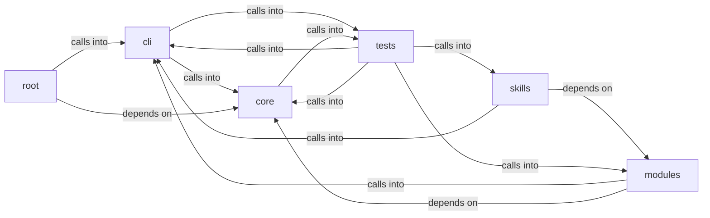

# cli

cli groups 123 files (py) around check_rhost, check_lhost, check_lport, check_port, require_rhost. LazyOwn CLI infrastructure.

```mermaid
graph LR
    cli["cli"]
    core["core"]
    modules["modules"]
    root["root"]
    skills["skills"]
    tests["tests"]
    cli -- "calls into" --> core
    cli -- "calls into" --> tests
    core -- "calls into" --> tests
    modules -- "calls into" --> cli
    modules -- "depends on" --> core
    root -- "calls into" --> cli
    root -- "depends on" --> core
    skills -- "calls into" --> cli
    skills -- "depends on" --> modules
    tests -- "calls into" --> cli
    tests -- "calls into" --> core
    tests -- "calls into" --> modules
    tests -- "calls into" --> skills
```

## cli (6.1)

cli groups 45 files (py) around Theme, get_theme, theme_from_payload, PendingCommandSet, is_pending. LazyOwn CLI infrastructure.

## core (6.2)

core groups 12 files (py) around check_rhost, check_lhost, check_lport, check_port, require_rhost. Core primitives for the LazyOwn framework.

## modules (6.3)

modules groups 4 files (py) around EvidenceConfig, hash_bytes, _validate_hash, EvidenceStore, __init__. Rich per-step engagement summaries from evidence and sessions artefacts.

## root (6.4)

root groups 1 files (py) around sanitize_content, RAGManager, __init__, initialize_cache_table, get_cache_key. RAGManager: Manages RAG functionality with CAG caching for document processing and...

## skills (6.5)

skills groups 7 files (py) around OrchestratorConfig, from_payload, OrchestratorGoal, with_defaults, OrchestratorResult. MCP tool ``lazyown_graph_neighbors`` (migrated from the call_tool dispatch chain).

## tests (6.6)

tests groups 54 files (py) around _StaticProvider, __init__, suggest, _RaisingProvider, suggest. Unit tests for cli.autosuggest.

**Files**:

- cli/__init__.py
- cli/autosuggest.py
- cli/chain_mode.py
- cli/command_explorer.py
- cli/command_form.py
- cli/commands/__init__.py
- cli/commands/_dormancy.py
- cli/commands/help_ui.py
- cli/commands/misc_migrated.py
- cli/commands/orchestration.py
- cli/config_status.py
- cli/contextual_help.py
- cli/dashboard_layout.py
- cli/dashboard_tui.py
- cli/doctor.py
- cli/exploration_view.py
- cli/graph_advisor.py
- cli/graph_overlay.py
- cli/killchain.py
- cli/marketplace_config.py
- cli/noise_verbs.py
- cli/palette.py
- cli/palette_command.py
- cli/palette_graph.py
- cli/palette_overlay.py
- cli/palette_telemetry.py
- cli/phase_labels.py
- cli/plugin_tiers.py
- cli/protips.py
- cli/reactive_hints.py
- cli/reasoning_stream.py
- cli/recommendation.py
- cli/recommendation_signals.py
- cli/registry.py
- cli/sessions_browser.py
- cli/splash.py
- cli/status_bar.py
- cli/themes.py
- cli/timeline_browser.py
- cli/tips_engine.py
- cli/toast_bus.py
- cli/tui_theme.py
- cli/tutorial.py
- cli/wizard.py
- cli/wizard_scope.py
- core/__init__.py
- core/console.py
- core/dependencies.py
- core/error_advice.py
- core/errors.py
- core/host_policy.py
- core/http.py
- core/network.py
- core/profiles.py
- core/safe_console.py
- core/text_utils.py
- core/validators.py
- lazy_sentinel4.py
- modules/engage_summary.py
- modules/enrich.py
- modules/evidence.py
- modules/privesc_predictor.py
- skills/mcp_tools/graph_neighbors.py
- skills/mcp_tools/graph_search.py
- skills/mcp_tools/graph_suggest_next.py
- skills/mcp_tools/graph_summary.py
- skills/mcp_tools/palette.py
- skills/mcp_tools/recommend_next.py
- skills/unified_orchestrator.py
- tests/test_autosuggest.py
- tests/test_chain_mode.py
- tests/test_command_form.py
- tests/test_command_palette.py
- tests/test_command_set_migration.py
- tests/test_console_stdio.py
- tests/test_daemon_ctl_command_set.py
- tests/test_dashboard_tui.py
- tests/test_dependencies.py
- tests/test_doctor.py
- tests/test_encoding_command_set.py
- tests/test_engage_gates.py
- tests/test_engage_summary.py
- tests/test_evidence_hints.py
- tests/test_exploration_and_addons.py
- tests/test_exposure_command_sets.py
- tests/test_graph_advisor.py
- tests/test_graph_overlay.py
- tests/test_help_ui_command_set.py
- tests/test_host_policy.py
- tests/test_improvements_spec.py
- tests/test_input_fuzz.py
- tests/test_killchain_auto_refresh.py
- tests/test_killchain_gap_signal.py
- tests/test_marketplace_config.py
- tests/test_nethelpers_command_set.py
- tests/test_palette_overlay.py
- tests/test_phase1_data_gaps.py
- tests/test_phase_labels.py
- tests/test_plugin_tiers.py
- tests/test_profiles.py
- tests/test_reactive_hints.py
- tests/test_reactive_hints_expanded.py
- tests/test_reasoning_stream.py
- tests/test_recommendation.py
- tests/test_require_guards.py
- tests/test_safe_console.py
- tests/test_scope_deny_priority.py
- tests/test_scope_guard_integration.py
- tests/test_session_ops_command_set.py
- tests/test_sessions_browser.py
- tests/test_shellsys_command_set.py
- tests/test_status_bar_operators.py
- tests/test_themes.py
- tests/test_timeline_browser.py
- tests/test_tips_engine.py
- tests/test_toast_bus.py
- tests/test_toastr_unify.py
- tests/test_tui_splash.py
- tests/test_tui_style.py
- tests/test_tui_theme_command.py
- tests/test_tui_themes.py
- tests/test_wizard_binary_check.py
- tests/test_wizard_llm.py
