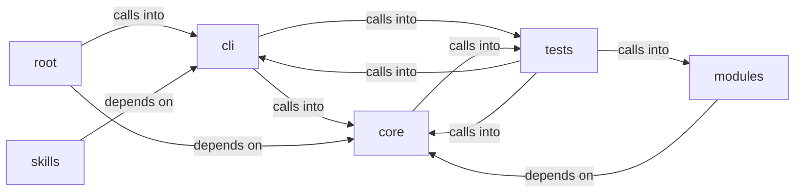

# cli

cli groups 68 files (py) around _sanitize, colors_enabled, _paint, format_line, print_error. LazyOwn CLI infrastructure.

```mermaid
graph LR
    cli["cli"]
    core["core"]
    modules["modules"]
    root["root"]
    skills["skills"]
    tests["tests"]
    cli -- "calls into" --> core
    cli -- "calls into" --> tests
    core -- "calls into" --> tests
    modules -- "depends on" --> core
    root -- "calls into" --> cli
    root -- "depends on" --> core
    skills -- "depends on" --> cli
    tests -- "calls into" --> cli
    tests -- "calls into" --> core
    tests -- "calls into" --> modules
```

## cli (9.1)

cli groups 29 files (py) around Theme, get_theme, theme_from_payload, CommandIndexError, load_index. LazyOwn CLI infrastructure.

## core (9.2)

core groups 5 files (py) around _sanitize, colors_enabled, _paint, format_line, print_error. ANSI color constants and console output helpers.

## modules (9.3)

modules groups 2 files (py) around GoalSpec, TaskConstraints, blocked, decompose_rule_based, load_constraints. Goal decomposition round-0 with constraints and proof.

## root (9.4)

root groups 1 files (py) around sanitize_content, RAGManager, __init__, initialize_cache_table, get_cache_key. RAGManager: Manages RAG functionality with CAG caching for document processing and...

## skills (9.5)

skills groups 1 files (py) around handle. MCP tool ``lazyown_palette`` (migrated from the call_tool dispatch chain).

## tests (9.6)

tests groups 30 files (py) around _StaticProvider, __init__, suggest, _RaisingProvider, suggest. Unit tests for cli.autosuggest.

**Files**:

- cli/__init__.py
- cli/autosuggest.py
- cli/chain_mode.py
- cli/command_explorer.py
- cli/command_form.py
- cli/commands/help_ui.py
- cli/config_status.py
- cli/contextual_help.py
- cli/doctor.py
- cli/exploration_view.py
- cli/marketplace_config.py
- cli/noise_verbs.py
- cli/palette.py
- cli/palette_command.py
- cli/palette_graph.py
- cli/palette_overlay.py
- cli/palette_telemetry.py
- cli/phase_labels.py
- cli/protips.py
- cli/reactive_hints.py
- cli/splash.py
- cli/status_bar.py
- cli/themes.py
- cli/tips_engine.py
- cli/toast_bus.py
- cli/tui_theme.py
- cli/tutorial.py
- cli/wizard.py
- cli/wizard_scope.py
- core/console.py
- core/error_advice.py
- core/profiles.py
- core/safe_console.py
- core/text_utils.py
- lazy_sentinel4.py
- modules/goals.py
- modules/privesc_predictor.py
- skills/mcp_tools/palette.py
- tests/test_autosuggest.py
- tests/test_chain_mode.py
- tests/test_command_form.py
- tests/test_command_palette.py
- tests/test_console_stdio.py
- tests/test_doctor.py
- tests/test_evidence_hints.py
- tests/test_exploration_and_addons.py
- tests/test_killchain_auto_refresh.py
- tests/test_lazy_parity.py
- tests/test_marketplace_config.py
- tests/test_palette_overlay.py
- tests/test_phase_labels.py
- tests/test_profiles.py
- tests/test_reactive_hints.py
- tests/test_reactive_hints_expanded.py
- tests/test_safe_console.py
- tests/test_scope_deny_priority.py
- tests/test_scope_guard_integration.py
- tests/test_status_bar_operators.py
- tests/test_themes.py
- tests/test_tips_engine.py
- tests/test_toast_bus.py
- tests/test_toastr_unify.py
- tests/test_tui_splash.py
- tests/test_tui_style.py
- tests/test_tui_theme_command.py
- tests/test_tui_themes.py
- tests/test_wizard_binary_check.py
- tests/test_wizard_llm.py
