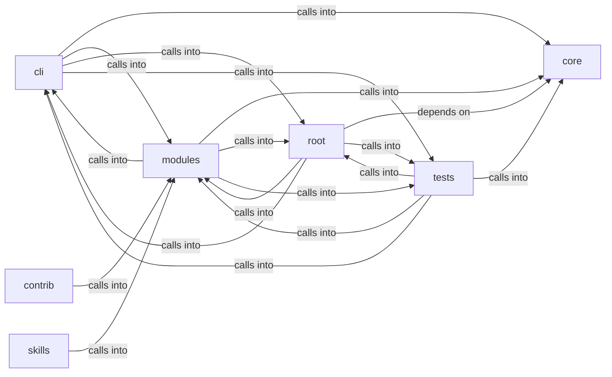

# cli/commands

cli/commands groups 148 files (py) around lazyown_set_config, needs_sudo, sudo_available, _retry_sudo_gate, redact_secrets. Autor: Gris Iscomeback Correo electrónico: grisiscomeback[at]gmail[dot]com Fecha de...

```mermaid
graph LR
    cli["cli"]
    contrib["contrib"]
    core["core"]
    modules["modules"]
    root["root"]
    skills["skills"]
    tests["tests"]
    cli -- "calls into" --> core
    cli -- "calls into" --> modules
    cli -- "calls into" --> root
    cli -- "calls into" --> tests
    contrib -- "calls into" --> modules
    modules -- "calls into" --> cli
    modules -- "calls into" --> core
    modules -- "calls into" --> root
    modules -- "calls into" --> tests
    root -- "calls into" --> cli
    root -- "depends on" --> core
    root -- "calls into" --> modules
    root -- "calls into" --> tests
    skills -- "calls into" --> modules
    tests -- "calls into" --> cli
    tests -- "calls into" --> core
    tests -- "calls into" --> modules
    tests -- "calls into" --> root
```

## cli (2.1)

cli groups 79 files (py) around extract_flag, LazyOwnCommandSet, _resolve_shell, params, payload. Configurable Neon Box banner for the LazyOwn interactive shell.

## contrib (2.2)

contrib groups 3 files (py) around ensure_http_prefix, signal_handler, main, parse_hash_file, reverse_shell.

## core (2.3)

core groups 4 files (py) around check_rhost, check_lhost, check_lport, check_port, require_rhost. Build-time default constants loaded from ``config/defaults.toml``.

## modules (2.4)

modules groups 19 files (py) around base64_encode, base64_decode, caesar_cipher, caesar_decipher, key_substitution. Browser-in-the-Middle (BitM) attack engine.

## root (2.5)

root groups 2 files (py) around lazyown_set_config, needs_sudo, sudo_available, _retry_sudo_gate, redact_secrets. Autor: Gris Iscomeback Correo electrónico: grisiscomeback[at]gmail[dot]com Fecha de...

## skills (2.6)

skills groups 1 files (py) around handle. MCP tool ``lazyown_list_modules``: list modules and scripts in modules/.

## tests (2.7)

tests groups 40 files (py) around AdLabCatalogueSpec, test_matrix_validates, test_summary_shape, test_all_vectors_resolve, test_get_unknown_is_none. Contract tests for the AD lab gym (Docker Samba DC) matrix and capture.

**Files**:

- banner.py
- cli/banner_config.py
- cli/commands/_base.py
- cli/commands/anti_forensics.py
- cli/commands/applocker_bypass.py
- cli/commands/bitm.py
- cli/commands/browser_sync.py
- cli/commands/c2_profile.py
- cli/commands/c2_session.py
- cli/commands/campaign.py
- cli/commands/catalog.py
- cli/commands/cicd.py
- cli/commands/cli_auth.py
- cli/commands/cloud.py
- cli/commands/collaboration.py
- cli/commands/command_and_control.py
- cli/commands/cred.py
- cli/commands/cred_migrated.py
- cli/commands/crystal_ball.py
- cli/commands/daemon_ctl.py
- cli/commands/database.py
- cli/commands/defaults.py
- cli/commands/demo.py
- cli/commands/dns_exfil.py
- cli/commands/dpapi.py
- cli/commands/edr_detect.py
- cli/commands/encoding.py
- cli/commands/estorides.py
- cli/commands/evasive_payload.py
- cli/commands/exfiltration.py
- cli/commands/exploit.py
- cli/commands/exploitdb.py
- cli/commands/exposure_autofire.py
- cli/commands/exposure_intel.py
- cli/commands/exposure_inventory.py
- cli/commands/exposure_sentinel.py
- cli/commands/exposure_timeline.py
- cli/commands/golden_paths.py
- cli/commands/gym_matrix.py
- cli/commands/infra.py
- cli/commands/lab.py
- cli/commands/lateral.py
- cli/commands/lateral_migrated.py
- cli/commands/lazy_creds.py
- cli/commands/lazy_dorks.py
- cli/commands/lazy_oob.py
- cli/commands/lazy_passgen.py
- cli/commands/lazy_poc.py
- cli/commands/loop_audit.py
- cli/commands/marketplace.py
- cli/commands/mobile_macos.py
- cli/commands/module_manager.py
- cli/commands/netattack.py
- cli/commands/nethelpers.py
- cli/commands/payload_generation.py
- cli/commands/persist.py
- cli/commands/phishing_wizard.py
- cli/commands/pivoting.py
- cli/commands/postexp.py
- cli/commands/postexp_migrated.py
- cli/commands/privilege_escalation.py
- cli/commands/resource_scripting.py
- cli/commands/retry_ops.py
- cli/commands/scan.py
- cli/commands/scan_migrated.py
- cli/commands/shellsys.py
- cli/commands/sidequest.py
- cli/commands/sleep_obfuscation.py
- cli/commands/socks_proxy.py
- cli/commands/supply_chain.py
- cli/commands/ux.py
- cli/commands/verb_admin.py
- cli/commands/winbox_gym.py
- cli/config_history.py
- cli/confirm.py
- cli/fuzzy_match.py
- cli/fuzzy_picker.py
- cli/output_mode.py
- cli/plugin_tiers.py
- cli/session_hud.py
- contrib/legacy/lazycreate_webshell.py
- contrib/legacy/lazylogpoisoning.py
- contrib/legacy/lazyreversentlmv2.py
- core/defaults.py
- core/host_policy.py
- core/safe_import.py
- core/validators.py
- modules/__init__.py
- modules/bitm_engine.py
- modules/c2_builder.py
- modules/categories.py
- modules/cicd_enumerator.py
- modules/cloud_enum.py
- modules/dpapi_harvester.py
- modules/edr_detector.py
- modules/evasive_payloads.py
- modules/lab_runtime.py
- modules/lazycloud.py
- modules/lazyencoder_decoder.py
- modules/lazypassgen.py
- modules/loop/worker_gating.py
- modules/loop_preflight.py
- modules/mfa_bypass.py
- modules/module_registry.py
- modules/professional_report.py
- modules/test_lazyencoder_decoder.py
- skills/mcp_tools/list_modules.py
- tests/test_ad_lab_gym.py
- tests/test_api_key_resolution.py
- tests/test_banner_config.py
- tests/test_bdd_infra_range_report.py
- tests/test_browser_sync.py
- tests/test_c2_agent_dual.py
- tests/test_campaign_import_safety.py
- tests/test_categories.py
- tests/test_credentials_rotation.py
- tests/test_fuzzy_picker.py
- tests/test_gym_matrix_ctf.py
- tests/test_host_policy.py
- tests/test_implant_session_secrets.py
- tests/test_infra_disposable.py
- tests/test_input_fuzz.py
- tests/test_lab_target_visibility.py
- tests/test_lazy_autofire.py
- tests/test_lazy_creds.py
- tests/test_lazy_finalizer.py
- tests/test_lazy_inventory.py
- tests/test_lazy_oob.py
- tests/test_lazy_runner_fallback.py
- tests/test_lazy_timeline.py
- tests/test_lazy_worker_safety.py
- tests/test_lazydorks.py
- tests/test_lazypassgen.py
- tests/test_lazypoophish.py
- tests/test_lazyshortener.py
- tests/test_loop_audit.py
- tests/test_loop_manager_outcome.py
- tests/test_loop_mentions.py
- tests/test_module_registry.py
- tests/test_module_registry_bridge.py
- tests/test_plugin_tiers.py
- tests/test_prompt_readline_markers.py
- tests/test_prompt_refresh.py
- tests/test_require_guards.py
- tests/test_ttpscope_bridge.py
- tests/test_unified_bridge_delegate.py
- tests/test_verb_catalog.py
- utils.py
