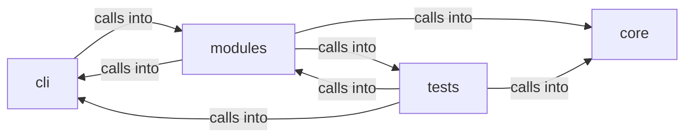

# modules: chain_runner

modules: chain_runner groups 73 files (py) around CommandInjectionError, UrlValidationError, needs_shell, safe_system, _kill_process_tree. Parsing, printing and replanning support for the ``apt_chain`` CLI.

```mermaid
graph LR
    cli["cli"]
    core["core"]
    modules["modules"]
    tests["tests"]
    cli -- "calls into" --> modules
    modules -- "calls into" --> cli
    modules -- "calls into" --> core
    modules -- "calls into" --> tests
    tests -- "calls into" --> cli
    tests -- "calls into" --> core
    tests -- "calls into" --> modules
```

## cli (7.1)

cli groups 3 files (py) around _parse_admin_flags, _token_name_ok, ChainArgs, parse_chain_args, _set_value. Parsing, printing and replanning support for the ``apt_chain`` CLI.

## core (7.2)

core groups 2 files (py) around CommandInjectionError, UrlValidationError, needs_shell, safe_system, _kill_process_tree. Centralized safe command execution for the LazyOwn framework.

## modules (7.3)

modules groups 30 files (py) around skip_pending, ChainStep, identifier, Chain, resolve. AD lab gym catalogue (Docker Samba DC): index, exploits, chains.

## tests (7.4)

tests groups 38 files (py) around _make_shell, _Set, _Shell, __init__, _write_chain. apt_chain admin & run options BDD contract.

**Files**:

- cli/apt_chain_support.py
- cli/commands/command_and_control_migrated.py
- cli/retry_support.py
- core/safe_exec.py
- core/safe_subprocess.py
- modules/ad_gym.py
- modules/apt_playbooks.py
- modules/atomic_cli.py
- modules/atomic_exploit_bridge.py
- modules/atomic_resolver.py
- modules/chain_approval.py
- modules/chain_distill.py
- modules/chain_facts.py
- modules/chain_loop.py
- modules/chain_registry.py
- modules/chain_runner.py
- modules/chain_state.py
- modules/chain_synth.py
- modules/chain_tokens.py
- modules/command_executor.py
- modules/ctf_capture.py
- modules/dns_beacon.py
- modules/emulation_runner.py
- modules/gym_matrix_runner.py
- modules/lazy_finalizer.py
- modules/lazy_scope.py
- modules/lazypoophish.py
- modules/lazyshortener.py
- modules/metasploitable_gym.py
- modules/metasploitable_migrations.py
- modules/playbook_admin.py
- modules/playbook_chain.py
- modules/retry_session.py
- modules/verb_manifest.py
- modules/winbox_gym.py
- tests/test_apt_chain_admin.py
- tests/test_apt_chain_integration.py
- tests/test_atomic_exploit_bridge.py
- tests/test_atomic_loop.py
- tests/test_atomic_resolver.py
- tests/test_chain_approval_c2.py
- tests/test_chain_approval_cli_wiring.py
- tests/test_chain_distill.py
- tests/test_chain_distill_custody.py
- tests/test_chain_distill_scope.py
- tests/test_chain_evidence.py
- tests/test_chain_finalizer.py
- tests/test_chain_freshness_guard.py
- tests/test_chain_loop.py
- tests/test_chain_parallel_fallback.py
- tests/test_chain_registry.py
- tests/test_chain_runner.py
- tests/test_chain_step_streaming.py
- tests/test_chain_synth.py
- tests/test_chain_token_hardening.py
- tests/test_chain_v24_core.py
- tests/test_codeql_alert_fixes.py
- tests/test_command_control_agent.py
- tests/test_emulation_runner.py
- tests/test_executor_kernel.py
- tests/test_f4_hardening.py
- tests/test_group_kill.py
- tests/test_metasploitable_gym.py
- tests/test_metasploitable_migrations.py
- tests/test_playbook_admin.py
- tests/test_playbook_chain.py
- tests/test_retry_session.py
- tests/test_safe_subprocess.py
- tests/test_safe_subprocess_behavior.py
- tests/test_security_hardening.py
- tests/test_security_hardening_v4.py
- tests/test_shell_semantics.py
- tests/test_verb_manifest.py
