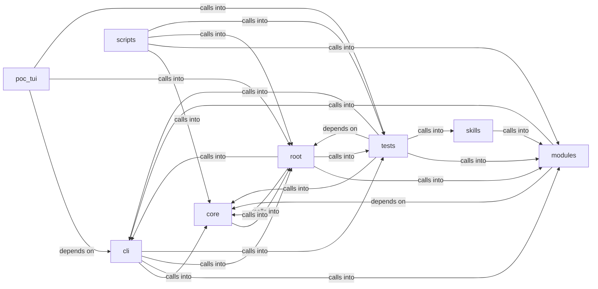

# modules: lazyown

modules: lazyown groups 95 files (py) around _apply_env_overrides, _coerce_env_value, _mask_if_sensitive, _log_config_change, _calling_frame. Declarative cmd2 alias loader.

```mermaid
graph LR
    cli["cli"]
    core["core"]
    modules["modules"]
    poc_tui["poc_tui"]
    root["root"]
    scripts["scripts"]
    skills["skills"]
    tests["tests"]
    cli -- "calls into" --> core
    cli -- "calls into" --> modules
    cli -- "calls into" --> root
    cli -- "calls into" --> tests
    core -- "calls into" --> root
    modules -- "calls into" --> cli
    modules -- "depends on" --> core
    poc_tui -- "depends on" --> cli
    poc_tui -- "calls into" --> root
    poc_tui -- "calls into" --> tests
    root -- "calls into" --> cli
    root -- "calls into" --> core
    root -- "calls into" --> modules
    root -- "calls into" --> tests
    scripts -- "calls into" --> core
    scripts -- "calls into" --> modules
    scripts -- "calls into" --> root
    scripts -- "calls into" --> tests
    skills -- "calls into" --> modules
    tests -- "calls into" --> cli
    tests -- "calls into" --> core
    tests -- "calls into" --> modules
    tests -- "depends on" --> root
    tests -- "calls into" --> skills
```

## cli (8.1)

cli groups 19 files (py) around EngagementState, _load_state, _save_state, _load_index, _normalize_command. Declarative cmd2 alias loader.

## core (8.2)

core groups 7 files (py) around _apply_env_overrides, _coerce_env_value, _mask_if_sensitive, _log_config_change, _calling_frame. Lightweight command execution bridge between C2 bots and the LazyOwn CLI shell.

## modules (8.3)

modules groups 28 files (py) around _load_users, _save_users, _load_payload, _save_payload, user_exists. Graphical sudo askpass helpers for desktop sudo prompts.

## poc_tui (8.4)

poc_tui groups 3 files (py) around ShellBackend, __init__, import_shell_class, start, run. Entry point: python3 -m poc_tui

## root (8.5)

root groups 1 files (py) around _ux_debug, _parse_bool_setting, _PayloadSettableProxy, __init__, __getattr__. lazyown  Author: Gris Iscomeback Email: grisiscomeback at gmail dot com Creation Date...

## scripts (8.6)

scripts groups 2 files (py) around AuditConfig, argparser_commands, audit, main, SmokeConfig. Audit every registered shell command for dispatch and parser errors.

## skills (8.7)

skills groups 1 files (py) around _sync_harness, _harness_result, _call_harness_tool, list_tools, call_tool. LazyOwn MCP OpenCode bridge.

## tests (8.8)

tests groups 34 files (py) around TestHexSource, test_valid_hex_decodes_to_32_bytes, test_wrong_length_raises, test_non_hex_raises, TestDiskSource. TDD tests for the AES key resolution contract.

**Files**:

- cli/aliases.py
- cli/auto_crypto.py
- cli/cli_enhancements.py
- cli/commands/audit.py
- cli/commands/containers.py
- cli/commands/diagnostics.py
- cli/commands/lazyloop.py
- cli/commands/persist_migrated.py
- cli/commands/purple_team.py
- cli/commands/recon_migrated.py
- cli/commands/redteam_gym.py
- cli/commands/security.py
- cli/engagement_hooks.py
- cli/headless.py
- cli/lazy_orchestrator.py
- cli/orchestrator_assets_tabs.py
- cli/purple_tui.py
- cli/surface_tui.py
- cli/tui_forms.py
- core/command_bridge.py
- core/config.py
- core/credential_vault.py
- core/crypto.py
- core/hardening.py
- core/protocols.py
- core/reverse_shell_secret.py
- lazyown.py
- modules/askpass.py
- modules/auto_purple.py
- modules/cli_auth.py
- modules/ctf_signalman.py
- modules/domain_dominance.py
- modules/gym_cleanup.py
- modules/gym_registry.py
- modules/harness.py
- modules/lazy_findings.py
- modules/lazy_ledger.py
- modules/lazyk8s.py
- modules/orchestrator_config.py
- modules/outcome_bus.py
- modules/payload_factory.py
- modules/phishing_orchestrator.py
- modules/redteam_gym.py
- modules/session_cleanup.py
- modules/sinks/__init__.py
- modules/sinks/attack_graph.py
- modules/sinks/beacon_dispatch.py
- modules/sinks/c2_surfaces.py
- modules/sinks/findings.py
- modules/sinks/intel_graph.py
- modules/sinks/killchain.py
- modules/sinks/objectives.py
- modules/sinks/routing.py
- modules/traffic_morpher.py
- modules/websocket_beacon.py
- poc_tui/__main__.py
- poc_tui/app.py
- poc_tui/test_app.py
- scripts/devtools/command_audit.py
- scripts/devtools/core_smoke.py
- skills/lazyown_mcp_opencode.py
- tests/test_aes_key_propagation.py
- tests/test_askpass.py
- tests/test_audit_remediation.py
- tests/test_backdoor_random.py
- tests/test_c2_agent.py
- tests/test_cli_auth_remember.py
- tests/test_cli_command_sets.py
- tests/test_cli_enhancements.py
- tests/test_core.py
- tests/test_core_command_bridge.py
- tests/test_credential_vault.py
- tests/test_engagement_and_ping.py
- tests/test_engagement_command_gate.py
- tests/test_engagement_elo_and_methodology.py
- tests/test_findings_gate.py
- tests/test_guardrails.py
- tests/test_gym_cleanup_policy.py
- tests/test_gym_cli.py
- tests/test_gym_lifecycle.py
- tests/test_gym_ms2_cli.py
- tests/test_gym_registry.py
- tests/test_lazy_findings.py
- tests/test_lazy_ledger.py
- tests/test_lazy_orchestrator.py
- tests/test_loop_evidence_wiring.py
- tests/test_loop_exit_gate.py
- tests/test_opencode_mcp_harness.py
- tests/test_orchestrator_yaml.py
- tests/test_outcome_bus.py
- tests/test_payload_factory.py
- tests/test_security_alerts_fix.py
- tests/test_security_hardening_v3.py
- tests/test_sink_lazy_intel.py
- tests/test_winbox_gym.py
