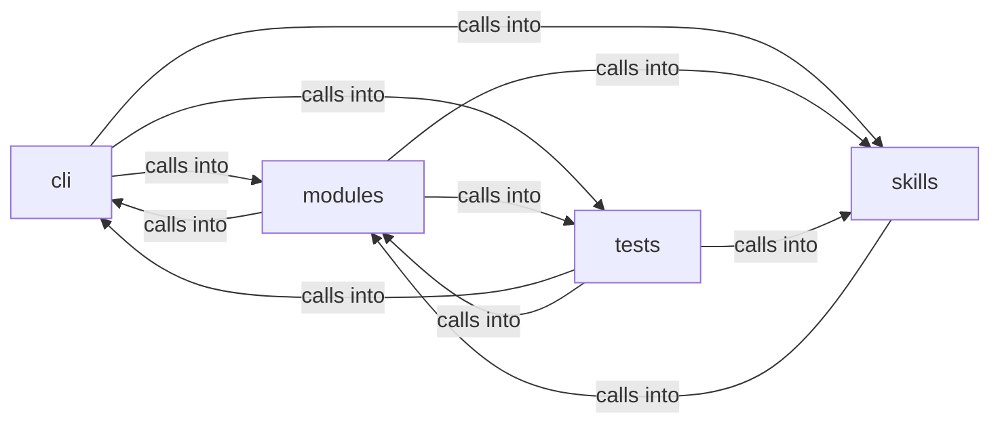

# modules: lazyown_facts

modules: lazyown_facts groups 63 files (py) around skip_pending, ChainStep, identifier, Chain, resolve. Parsing, printing and replanning support for the ``apt_chain`` CLI.

```mermaid
graph LR
    cli["cli"]
    modules["modules"]
    skills["skills"]
    tests["tests"]
    cli -- "calls into" --> modules
    cli -- "calls into" --> skills
    cli -- "calls into" --> tests
    modules -- "calls into" --> cli
    modules -- "calls into" --> skills
    modules -- "calls into" --> tests
    skills -- "calls into" --> modules
    tests -- "calls into" --> cli
    tests -- "calls into" --> modules
    tests -- "calls into" --> skills
```

## cli (8.1)

cli groups 4 files (py) around _apply_limit, _parse_admin_flags, _token_name_ok, ChainArgs, parse_chain_args. Parsing, printing and replanning support for the ``apt_chain`` CLI.

## modules (8.2)

modules groups 24 files (py) around skip_pending, ChainStep, identifier, Chain, resolve. APT Playbook Engine — map public APT reports to executable Atomic Red Team chains.

## skills (8.3)

skills groups 3 files (py) around Config, default, ServiceFact, CredentialFact, ShareFact. LazyOwn FactStore

## tests (8.4)

tests groups 32 files (py) around _make_shell, _Set, _Shell, __init__, _write_chain. apt_chain admin & run options BDD contract.

**Files**:

- cli/apt_chain_support.py
- cli/commands/command_and_control_migrated.py
- cli/commands/lazy_adaptive.py
- cli/retry_support.py
- modules/apt_playbooks.py
- modules/atomic_cli.py
- modules/atomic_resolver.py
- modules/chain_approval.py
- modules/chain_distill.py
- modules/chain_facts.py
- modules/chain_loop.py
- modules/chain_registry.py
- modules/chain_runner.py
- modules/chain_state.py
- modules/chain_synth.py
- modules/chain_tokens.py
- modules/emulation_runner.py
- modules/failure_verdict.py
- modules/gym_matrix_runner.py
- modules/lazy_deviations.py
- modules/lazy_fallback.py
- modules/lazy_finalizer.py
- modules/lazy_scope.py
- modules/playbook_admin.py
- modules/playbook_chain.py
- modules/retry_session.py
- modules/ttpscope_bridge.py
- modules/verb_manifest.py
- skills/lazyown_facts.py
- skills/mcp_tools/ttp_chain.py
- skills/tests/test_facts.py
- tests/test_apt_chain_admin.py
- tests/test_apt_chain_integration.py
- tests/test_atomic_loop.py
- tests/test_atomic_resolver.py
- tests/test_chain_approval_c2.py
- tests/test_chain_approval_cli_wiring.py
- tests/test_chain_distill.py
- tests/test_chain_distill_custody.py
- tests/test_chain_distill_scope.py
- tests/test_chain_evidence.py
- tests/test_chain_finalizer.py
- tests/test_chain_freshness_guard.py
- tests/test_chain_loop.py
- tests/test_chain_parallel_fallback.py
- tests/test_chain_registry.py
- tests/test_chain_runner.py
- tests/test_chain_step_streaming.py
- tests/test_chain_synth.py
- tests/test_chain_token_hardening.py
- tests/test_chain_v24_core.py
- tests/test_codeql_alert_fixes.py
- tests/test_command_control_agent.py
- tests/test_emulation_runner.py
- tests/test_f4_hardening.py
- tests/test_failure_verdict.py
- tests/test_lazy_adaptive_replan.py
- tests/test_lazy_deviations.py
- tests/test_lazy_fallback.py
- tests/test_playbook_admin.py
- tests/test_playbook_chain.py
- tests/test_retry_session.py
- tests/test_verb_manifest.py
