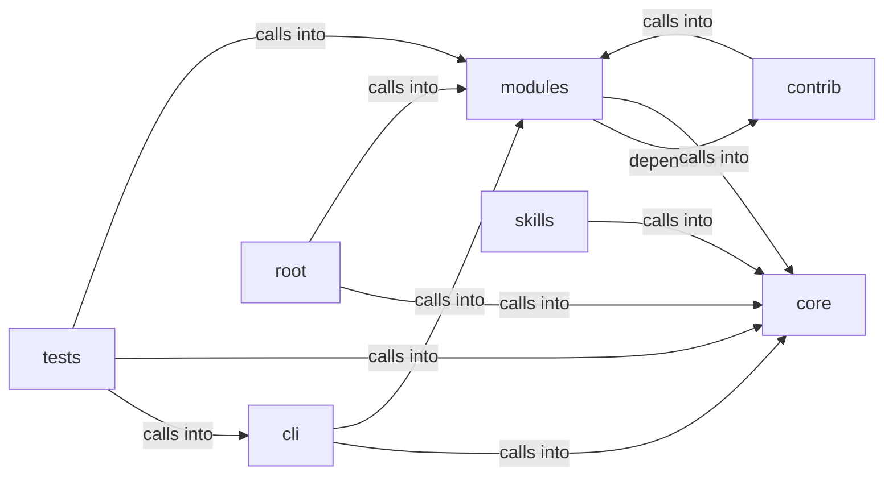

# modules: llm_budget

modules: llm_budget groups 37 files (py) around is_model_missing_error, groq_model_chain, LLMBackendUnavailableError, LLMBackendNotSupportedError, default_model_for. Artificial Intelligence command set.

```mermaid
graph LR
    cli["cli"]
    contrib["contrib"]
    core["core"]
    modules["modules"]
    root["root"]
    skills["skills"]
    tests["tests"]
    cli -- "calls into" --> core
    cli -- "calls into" --> modules
    contrib -- "calls into" --> modules
    modules -- "depends on" --> contrib
    modules -- "calls into" --> core
    root -- "calls into" --> core
    root -- "calls into" --> modules
    skills -- "calls into" --> core
    tests -- "calls into" --> cli
    tests -- "calls into" --> core
    tests -- "calls into" --> modules
```

## cli (11.1)

cli groups 1 files (py) around AiCommandSet, do_ask, do_groq, do_poolcheck, _serve. Artificial Intelligence command set.

## contrib (11.2)

contrib groups 3 files (py) around clean_think, clean_yaml, truncate_message, configure_logging, create_complex_prompt. parse_github_url: Extrae (owner, repo) de una URL de GitHub.

## core (11.3)

core groups 2 files (py) around strip_ansi, BudgetExceeded, LLMBackendLike, generate, stream_generate. LLM budget cap and per call token counter.

## modules (11.4)

modules groups 16 files (py) around is_model_missing_error, groq_model_chain, LLMBackendUnavailableError, LLMBackendNotSupportedError, default_model_for. LazyOwn AI Agent - Ultimate Edition Improvements: anti-hang timeout, memory...

## root (11.5)

root groups 4 files (py) around SecureSessionManager, __init__, register_failed_attempt, check_lockout, check_rate_limit. download_c2: Handle the /download_c2 command to download a file from the C2.

## skills (11.6)

skills groups 1 files (py) around handle. MCP tool ``lazyown_get_llm_budget``: read the LLM cost budget status.

## tests (11.7)

tests groups 10 files (py) around _isolated_llm_health, _isolated_path, _fast_llm_connect_backoff, _reset_world_model_singleton, _reset_guard_harness. Global pytest isolation hooks.

**Files**:

- cli/commands/ai.py
- contrib/legacy/lazyaddon_creator.py
- contrib/legacy/lazyllmchat.py
- contrib/legacy/lazyphishingai.py
- core/llm_budget.py
- core/parsers.py
- discord_c2.py
- modules/agent_runner.py
- modules/ai_fallback.py
- modules/ai_model.py
- modules/lazy_agent.py
- modules/llm_adapter.py
- modules/llm_client.py
- modules/llm_factory.py
- modules/llm_orchestrator.py
- modules/llm_prompts.py
- modules/loop_ai_bridge.py
- modules/recommender.py
- modules/session_state.py
- modules/sidequestion.py
- modules/vuln_bot_cli.py
- modules/vulnbot.py
- modules/yaml_generator.py
- skills/mcp_tools/get_llm_budget.py
- slack_c2_bot.py
- telegram_c2.py
- telegram_hermes.py
- tests/conftest.py
- tests/test_ai_commands_llm.py
- tests/test_lazy_streaming.py
- tests/test_llm_adapter_parity.py
- tests/test_llm_budget.py
- tests/test_llm_orchestrator.py
- tests/test_llm_prompts.py
- tests/test_loop_ai_bridge.py
- tests/test_single_implementation.py
- tests/test_vulnbot_fallback.py
