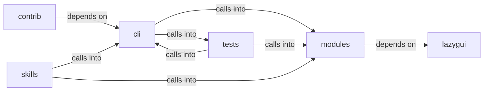

# modules: world_model

modules: world_model groups 65 files (py) around _derive_crypto_key, _machine_password, _master_password, _load_or_create_salt, _encrypt_payload. Command chain registry: explicit prerequisites and dynamic next steps.

```mermaid
graph LR
    cli["cli"]
    contrib["contrib"]
    lazygui["lazygui"]
    modules["modules"]
    skills["skills"]
    tests["tests"]
    cli -- "calls into" --> modules
    cli -- "calls into" --> tests
    contrib -- "depends on" --> cli
    modules -- "depends on" --> lazygui
    skills -- "calls into" --> cli
    skills -- "calls into" --> modules
    tests -- "calls into" --> cli
    tests -- "calls into" --> modules
```

## cli (9.1)

cli groups 11 files (py) around ExplorationConfig, DiscoveredService, label, AddonEntry, ToolEntry. Command chain registry: explicit prerequisites and dynamic next steps.

## contrib (9.2)

contrib groups 3 files (py) around BinaryFinder, __init__, find_suid_binaries, find_capabilities_binaries, find_executable_binaries.

## lazygui (9.3)

lazygui groups 2 files (py). LazyOwn Operator Console.

## modules (9.4)

modules groups 22 files (py) around _derive_crypto_key, _machine_password, _master_password, _load_or_create_salt, _encrypt_payload. modules/compliance.py

## skills (9.5)

skills groups 7 files (py) around handle, handle, handle, _has_data, handle. MCP tool ``lazyown_command_next`` (migrated from the call_tool dispatch chain).

## tests (9.6)

tests groups 20 files (py) around _svc, _FakeEngine, __init__, services, unexplored_addons. Tests for cli/command_chain.py.

**Files**:

- cli/command_chain.py
- cli/commands/pwn.py
- cli/dashboard_layout.py
- cli/dashboard_tui.py
- cli/exploration.py
- cli/killchain.py
- cli/lazynmap_post.py
- cli/ops_commands.py
- cli/recommendation.py
- cli/recommendation_signals.py
- cli/recon_plan.py
- contrib/legacy/lazypwn.py
- contrib/legacy/lazyvsftp.py
- contrib/legacy/sql.py
- lazygui/__init__.py
- lazygui/version.py
- modules/compliance.py
- modules/dashboard_engine.py
- modules/estorides_importer.py
- modules/exploit_recommender.py
- modules/factsio.py
- modules/golden_path.py
- modules/integrations/__init__.py
- modules/integrations/misp_export.py
- modules/integrations/nuclei_bridge.py
- modules/integrations/nuclei_parser.py
- modules/integrations/searchsploit.py
- modules/intelligence_engine.py
- modules/kill_chain_viz.py
- modules/killchain.py
- modules/lazy_osinfer.py
- modules/lazy_surface_diff.py
- modules/lazy_timeline.py
- modules/live_surface.py
- modules/rich_tui.py
- modules/unified_dashboard.py
- modules/world_model.py
- modules/yara_scanner.py
- skills/mcp_tools/command_next.py
- skills/mcp_tools/command_prev.py
- skills/mcp_tools/dashboard_snapshot.py
- skills/mcp_tools/exploit_recommend.py
- skills/mcp_tools/recommend_next.py
- skills/mcp_tools/rich_tui_snapshot.py
- skills/mcp_tools/unified_dashboard.py
- tests/test_command_chain.py
- tests/test_dashboard_tui.py
- tests/test_golden_path.py
- tests/test_intelligence_engine.py
- tests/test_killchain.py
- tests/test_killchain_gap_signal.py
- tests/test_killchain_snapshot.py
- tests/test_killchain_unified.py
- tests/test_killchain_unified_v2.py
- tests/test_lazy_intel_wiring.py
- tests/test_lazynmap_post.py
- tests/test_live_surface.py
- tests/test_nuclei_parser.py
- tests/test_ops_loot_phase.py
- tests/test_phase1_data_gaps.py
- tests/test_recommendation.py
- tests/test_recon_plan.py
- tests/test_single_source_of_truth.py
- tests/test_unified_dashboard.py
- tests/test_world_model_extended.py
